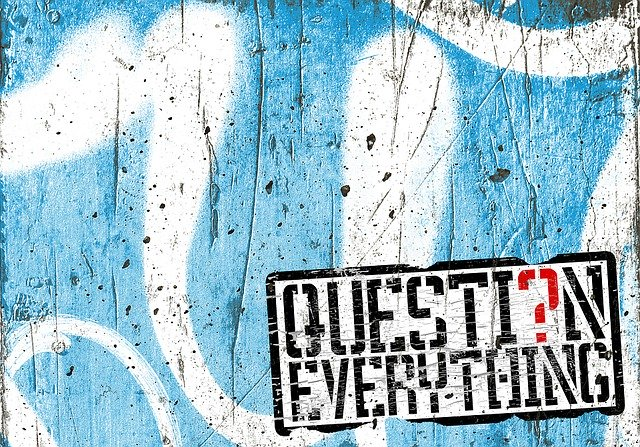
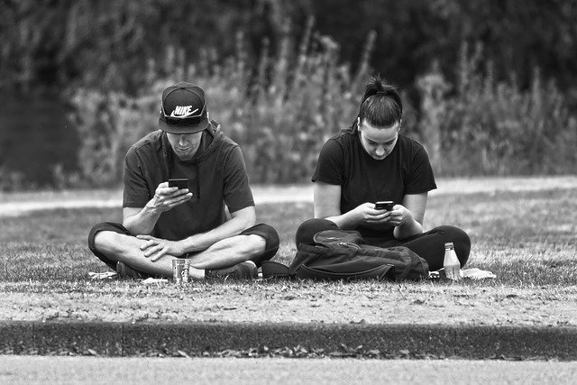
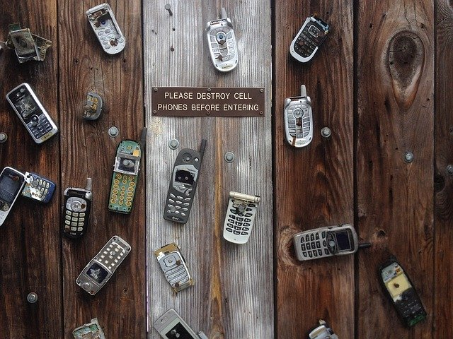
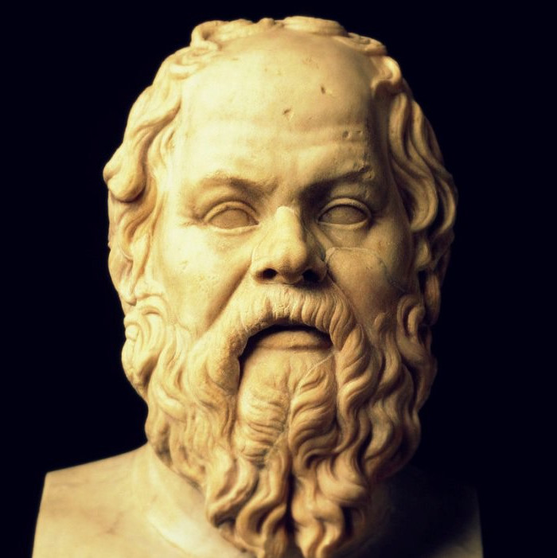
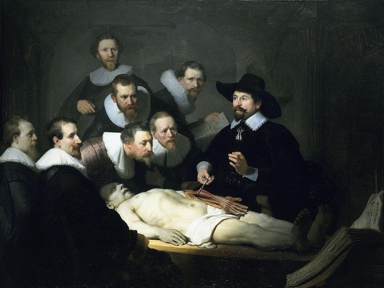

class: middle center

# *Philosophy, science and skepticism*

.small-text[George Matthews, Plymouth State University

*2020*]

---
class: center
layout: true

### *What would life be like...*

---

---

### *...without cell phones?*

---
layout: false

### *Question everything?*

.left-column[

   

]

  

.middletext[

.left-blurb[

"The unexamined life is not worth living."

]
]

.right-list[

- One of the founders of Western philosophy, Socrates spent his life encouraging others to critically examine their fundamental values and assumptions.

- He was executed on charges of "corrupting the youth."

- But really others just found his relentless questioning annoying and threatening.

]

---
### *Philosophy and skepticism*

*Philo-sophia*: "the love of wisdom"
 
- Philosophy seeks understanding of the nature of reality and the significance of our lives by critically questioning our **deepest and most general beliefs**.

- It draws out basic assumptions, asking questions with **the wonder of a child**.

- It subjects all ideas and claims to careful analysis with **the precision of a lawyer**.

.question[

If everything is open to question how can we know anything at all?

Is **wisdom** just knowing how little you know?

]

---
layout: false

### 

.narrow-text[
.question[

How can we even tell?

Should we be skeptical of the claim that they have or not?

What is the difference between philosophical and scientific skepticism?

]
]

---
### *Organized skepticism*

.example[.red[Science keeps skepticism contained with:]

- **Rejection of global doubts**: don't have such an open mind that your brains fall out.

- **Reliance on public evidence:** many eyes make all problems easy.

- **Trusting strength in numbers:** if it can't be repeated it can't be trusted.

- **Structured testing:** make risky predictions and be willing to admit failure.

- **Resistance to theory:** let the the big picture emerge on its own.]

---

layout: false
### *Philosophical questions*

.narrow-text[
.question[

.xlarge-text[ .red[What is reality like?] ]

- Metaphysics or Ontology

.xlarge-text[ .red[What can I know?] ]

- Epistemology or Theory of Knowledge

.xlarge-text[ .red[What should I do?] ]

- Axiology or Value Theory

]
]
---
### *What is reality like?*

.leftbar[
   

]

.middletext[

  

.left-blurb[

"Do we have free will or are we just cogs in a vast machine?"

]

]

.right-list[

- Philosophical questions are often much more general than questions we normally encounter.

]

.right-list[

- Science seeks answers to particular questions about the regularities in the world of our experience and shrinks away from such general questions as this.

]

.right-list[

- This is a question in the sub-field of philosophy called .red[metaphysics] or .red[ontology] which seeks an account of the basic nature of reality.

]

---
### *What can I know?*

.leftbar[
   

]

.middletext[

  

.left-blurb[

"What can I know with any degree of certainty, when my senses so often mislead me?"

]

]

.right-list[

- Descartes asked this question at the beginning of the Scientific Revolution when old "certainties" were revealed to be based on false assumptions.

]

.right-list[

- Answering it requires clarifying the nature and limitations of knowledge.

]

.right-list[

- This is a question in the sub-field of philosophy called .red[epistemology] or .red[theory of knowledge].

]

---
### *What should I do?*

.leftbar[
   

]

.middletext[

  

.left-blurb[

"How should I live my life? In pursuit of power and money or in pursuit of wisdom?" 

]

]

.right-list[

- This is not a question about how we do in fact live but of how we *should* live.

]

.right-list[

- Such *normative* questions challenge us to give an account of ourselves, our values and our assumptions.

]

.right-list[

- Socrates' question is a question in the sub-field of philosophy called .red[value theory] or .red[axiology].

]

---
layout: false

.pull-left[

 

### .center[.red[*More metaphysical questions...*]]
]

.pull-right[

]

 

- What sorts of things exist -- only matter, or minds/souls/disembodied spirits as well?

- What *is* the relationship between minds and brains, and can we build an artificial brain that actually has a mind?

- How does order arise in the universe and what is the role of chance in the way things are?

- Are purposes built-in to things or imposed on them by us?

---

layout: false

.pull-left[

 

### .center[.red[*More epistemological questions...*]]
]

.pull-right[

]

 

- How can we distinguish between appearances and reality?

- What counts as evidence, proof, or disproof and how does logical reasoning work?

- What is science and how do we distinguish it from pretenders to science?

- What is truth and is it singular or plural?

---
layout: false

.pull-left[

 

### .center[.red[*More value theory questions...*]]
]

.pull-right[

]

 

- Is it ever wrong to pursue knowledge and is it sometimes just best *not* to know?

- Is science value neutral, with moral questions only relevant to the application of scientific findings?

- Is scientific knowledge public or private, and who should profit from new discoveries?

- What role should scientific findings play in social policy?

---
layout: true

## *The philosopher's toolkit*

---

.caution[
Since philosophy asks us to examine *all* of our assumptions, there can be no fixed method for doing philosophy - historically speaking there have been many different approaches.
]

Over time, however, certain useful principles have been developed.

- Explicitly state our .red[assumptions] -- this can be a challenge since they *are* assumptions after all.

- Draw out their logical .red[implications] -- do these assumptions fit well with each other and do they clash with other ideas we have?

- Make lots of .red[distinctions]. (Philosophers have a bad reputation for "splitting hairs," but we think it is important to be precise in our use of language.)

---

layout: false
### *Find out more*

 and questioning others about their values. A great video outlining the motivation for doing philosophy in the first place.

: The Crash Course is a series of short, entertaining and informative videos produced by the Green bothers John and Hank. Here Hank Green gives his take on what philosophy is.

: the second video in the Crash Course Philosophy series outlines the basics of philosophical reasoning and argumentation.

---
class: center credits

 

#### Credits

*Built with:*

 

 html presentation framework 

*Photos by:*

, , 

[download this presentation](./pdf/01-slides.pdf) or [print it](./pdf/01-handout.pdf)

