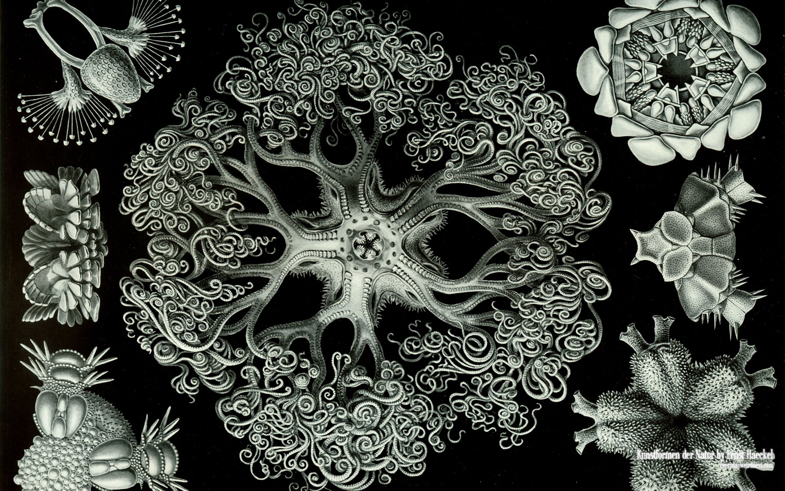

class: middle center fractal

# *What is science anyway?*

### *method, knowledge, attitude*

.author[George Matthews, Plymouth State University

*2020*
]
---

## *the scientific method*

--

- Make lots of careful observations.

--

- Look for apparent patterns in the observations.

--

- Take a guess at an explanation for those patterns.

--

- Deduce consequences of your explanations.

--

- Test to see if those appear.

--

- Repeat with more observations, other explanations, new consequences, adjusting as consequences fail to appear.

---

---

---
layout: false

## find out more

---

#### Credits

*Built with:*

 

 html presentation framework 

*Photos by:*

 at Pixabay.

[download this presentation](./pdf/01-slides.pdf) or [print it](./pdf/01-handout-print.pdf)

: requires a (free) GitHub account.

