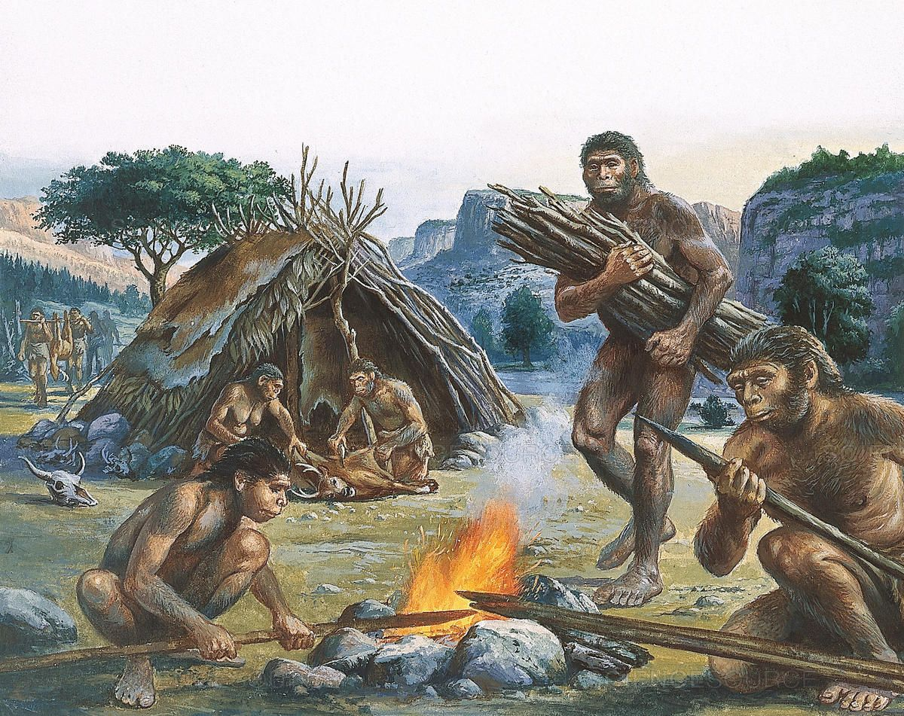

class: middle center

# *On the Origins of Science*

### *from seeing patterns to building models*

.small-text[George Matthews, Plymouth State University

*2020*]

---
layout: true
class: middle center credits

---

~2,000,000 years ago

---

~1,000,000 years ago

---

The "out of Africa" theory of human origins.
---

~17,000 years ago
---

~5,000 years ago
---

~5,000 years ago
---

~5,000 years ago
---

~5,000 years ago
---

writing ~5,000 years ago
---

mathematics ~4,000 years ago
---

---

patterns in the night sky

---

---

447 BCE

---
layout: true
class: xlarge

---

.left-column[

]

.right-column[

.topcap[

"All things are made of water."

]

- Thales made first recorded attempt at a naturalistic explanation of things.
 
- He relied on experience and observation to come up with general claims.

]

---

.left-column[

]

.right-column[

.topcap[

"All things are structured by numbers."

]

- Pythagoras emphasized proportion, symmetry and order as essential to the nature of things.
 
- Leader of a vegetarian mystical cult in Sicily.

- Distressed by the discovery of irrational numbers.

]

---

.left-column[

]

.right-column[

.topcap[

"You can't step into the same river twice."

]

- Heraclitus was an early philosopher who attempted to describe the nature of things in general terms.
 
- Emphasized change and motion, denying that anything had permanent features.

- Believed that the world was ultimately logical and understandable.
 
]

---

.left-column[

]

.right-column[

.topcap[

"Motion and change are illusions."

]

- Zeno was a follower of Parmenides who emphasized the unity and permanent nature of things.
 
- Came up with a series of paradoxes to prove that motion and change were impossible.

]

---

.left-column[

]

.right-column[

.topcap[

"All people by nature desire to know."

]

- Aristotle was the teacher of Alexander the great and was the founder of many branches of science.
 
- Developed a framework for understand all natural phenomena that held sway for 1500 years.

- Emphasized direct observation of nature as the source of knowledge.

]

---

.left-column[

]

.right-column[

.topcap[

"Give me a place to stand and a lever and I will move the whole world."

]

- Archimedes was an engineer, scientist and mathematician.
 
- Developed theory of simple machines: lever, pulley and screw that have mechanical advantage.

- Famous for his "eureka" moment in a bathtub.
 
]

---

.left-column[

]

.right-column[

.topcap[

"The universe is a set of nested crystal spheres rotating around the earth."

]

- Ptolemy created first comprehensive model of the known physical universe.
 
- His "geocentric model" of the cosmos would be consensus view for 1500 years.

- Synthesized the best theoretical and astronomical knowledge of his time and sought to "preserve the phenomena."
 
]

---
layout: false

## find out more

: a great short documentary by John and Hank Green on human evolution.

: The School of Life's video on the lasting contributions of the Ancient Greeks to world culture.

: a comprehensive account of the ideas of the Greek philosophers before Socrates who got the whole game going.

: find out more about Socrates and his life.

---
class: middle credits center

#### Credits

*Built with:*

 

 html presentation framework 

[download this presentation](./pdf/01-slides.pdf) or [print it](./pdf/02-handout.pdf)

