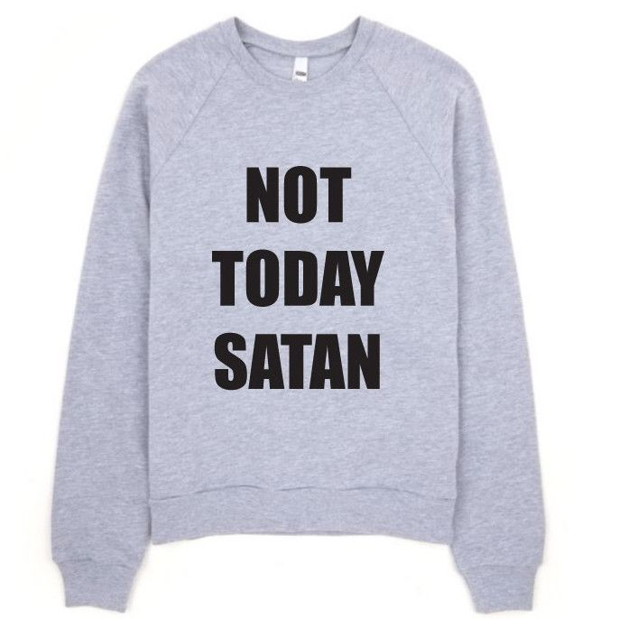
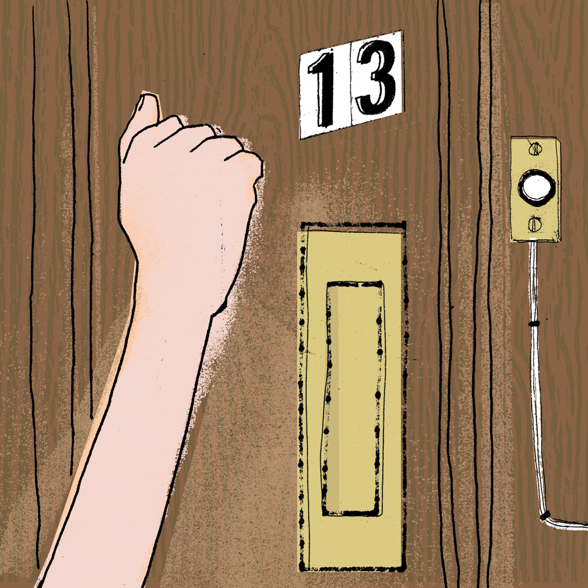

class: middle center

# *Magical Thinking*

### *Are we hard-wired for superstition?*

.small-text[George Matthews, Plymouth State University

*2020*]

---
layout: true
class: center

# *Would you ...*

---

--

### *wear your grandpa's sweatshirt?*

---

### *wear a serial killer's sweatshirt?*

---

### *eat organic, grass-fed beef?*

---

### *eat lab-grown meat?*

---

### *visit the grave site of a loved one?*

---

### *sleep in an old graveyard?*

---

### *knock on wood to avoid bad things happening?*

---

### *use a Ouija board?*

---
layout: false

### *Approaches to magical thinking*

.example[

**_Embrace it:_**
  - "The world just is full of magic!"

**_Dismiss it:_**
  - "It's nonsense, who are you kidding?"

**_Tolerate it:_**
- "It might work for you even if it doesn't work for me."

**_Try to explain it:_**
- "It shows us something about how the mind works."
]

---

### *Elements of magical thinking*

.example[

**_Essentialism_**

- Certain things have a fixed inner nature that explains what they do.

![:vspace 5]

**_Words and thoughts have power_**

- Language, thoughts and symbols can make stuff happen in the world directly.

![:vspace 5]

**_Agents are everywhere_**

- Disembodied spirits, ghosts, divine minds, etc. are always watching and might do things at any moment.
]

---

### *Essentialism*

.argument[
- Some things have essential, permanent features built-in to them.

- These "essences" determine how things behave, and what their "natural place" in the order of things is and should be.

- It is *wrong* to treat things differently than what their essence demands.
]

![:vspace 30]

.question[

Is this a side-effect of our capacity to categorize things and form concepts?

]

---

### *Words and thoughts have power*

.argument[
- Words, symbols and thoughts can have a direct influence on events in the real world.

- Words and thoughts can evoke the dead, cause good or bad things to happen, counteract or enhance the effects of other words.

- Symbols and symbolic objects can influence events from a distance.
]

![:vspace 30]

.question[

Is this a result of our taking literally the power of language and symbolism to suggest and evoke ideas?

]

---

### *Agents are everywhere*

.argument[
- There are hidden beings with minds all over the place.

- Nothing happens by chance and everything happens for a reason.

- Hidden agents create and maintain order, administer justice, help or hinder our plans.
]

![:vspace 30]

.question[

Is this a side-effect of our hyper-developed social minds, coupled with a bias towards paranoia?

]

---

layout: false

## find out more

---
class: middle credits center

#### Credits

*Built with:*

 

 html presentation framework 

[download this presentation](./pdf/03-slides.pdf) or [print it](./pdf/03-handout.pdf)

