class: middle center

# *The Scientific Revolution*

### *the world turned upside down*

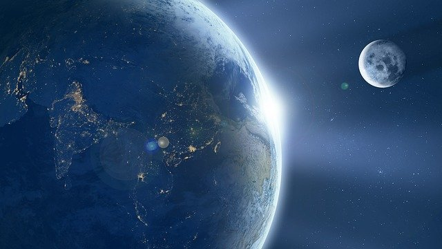

.small-text[George Matthews, Plymouth State University

*2020*]

---
class: center

.xlarge-text[*Heaven and Earth: before and after*]

.pull-left[

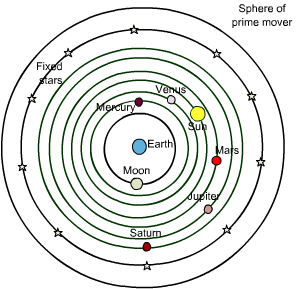

![:vspace 10]

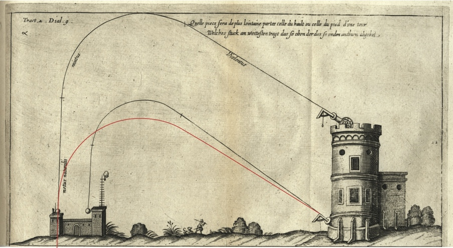

]

.pull-right[

![:vspace 20]

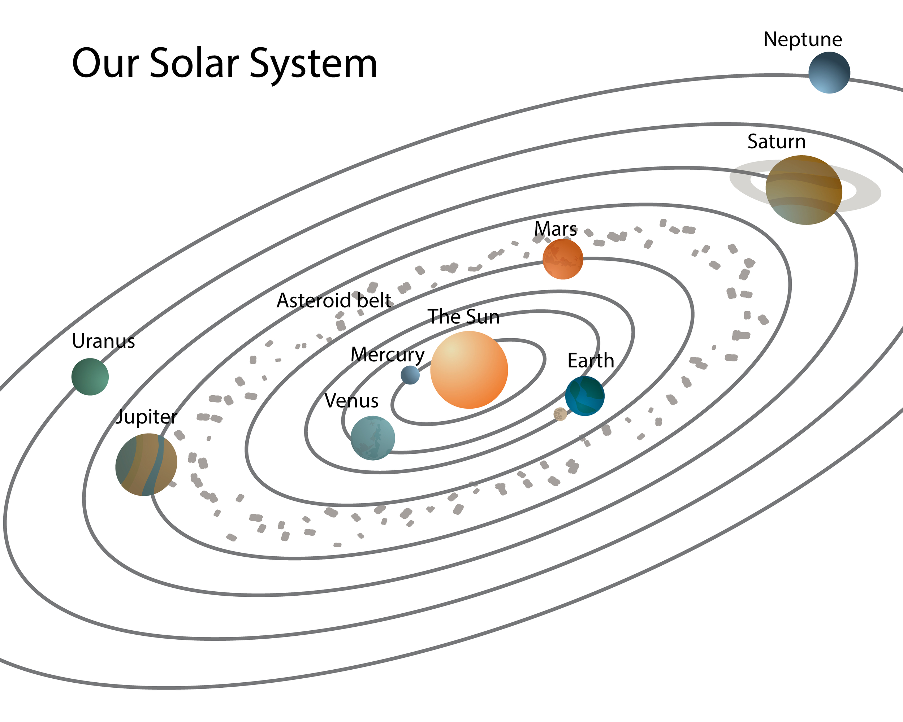

![:vspace 25]

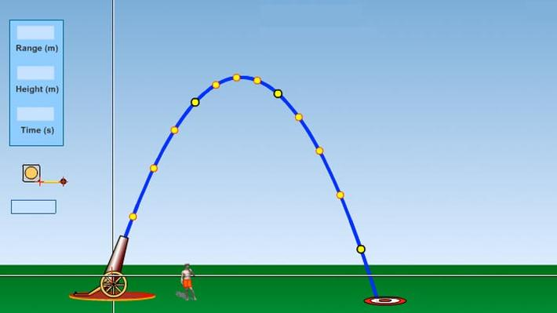

]

---
### *The Medieval World View*

.pull-left[

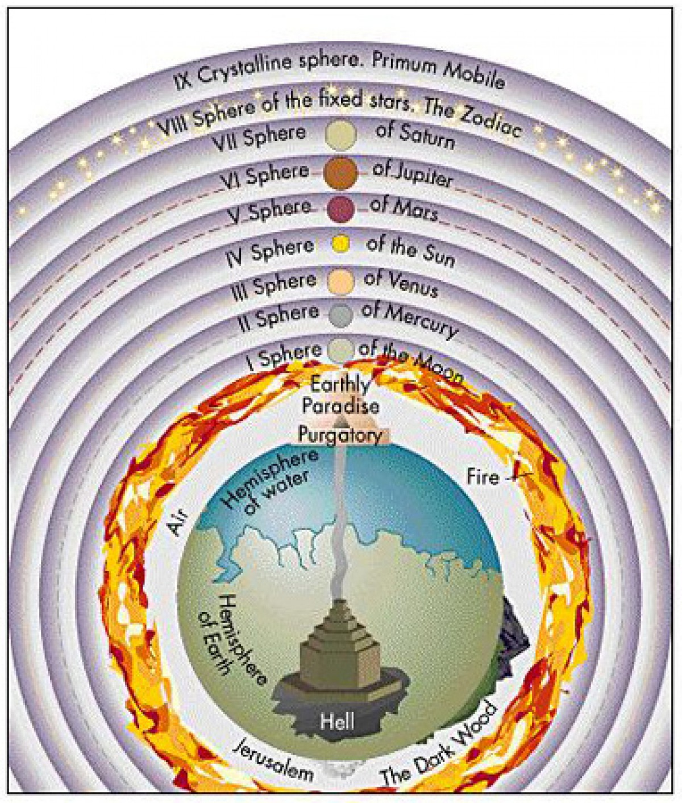

]

.pull-right[

The universe is split in two:

- heaven and earth
- mind and matter
- humans and animals
- saints and sinners
- perfection and imperfection

Human life plays out on center stage between heaven and earth and everything else revolves around this drama.

]

---
class: middle

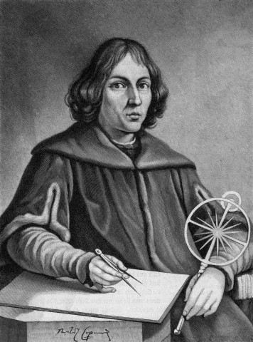

.quote-box[

"Therefore, when I considered this carefully, the contempt which I had to fear because of the novelty and apparent absurdity of my view, nearly induced me to abandon utterly the work I had begun."

]

---

### *Copernicus' Challenge*

.pull-left[

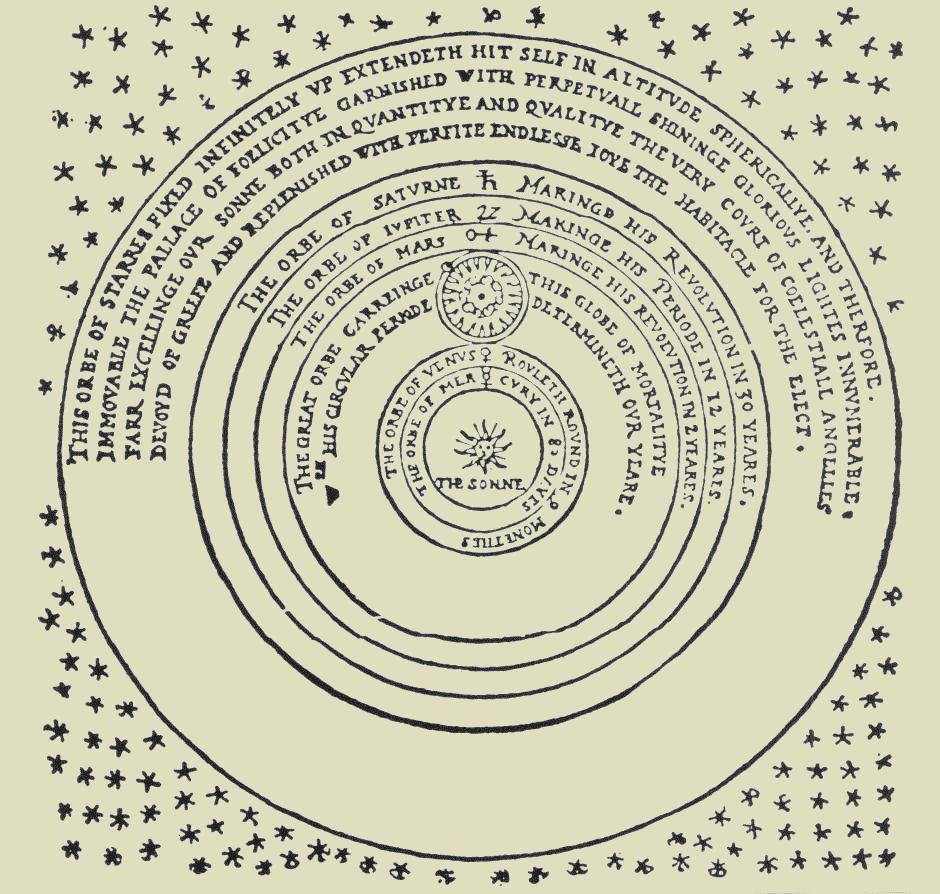

]

--

.half-list[

.red[Nicholas Copernicus] was a Polish monk, mathematician and diplomat first proposed Heliocentric solar system as mathematically simpler.

]

--

.half-list[

*On the Revolutions of the Heavenly Spheres* was only published after his death, since he feared controversy.

]

--

.half-list[

60 years after his death only 15 people accepted his theory.

]

---

class: middle

.quote-box[
"The machine of Heaven is not a hard and impervious body full of various real spheres . . . it extends everywhere, most fluid and simple, and nowhere presents obstacles as was formerly held, the circuits of the Planets being wholly free . . . being divinely governed under a given law."
]

---

### *Brahe's Data*

.pull-left[

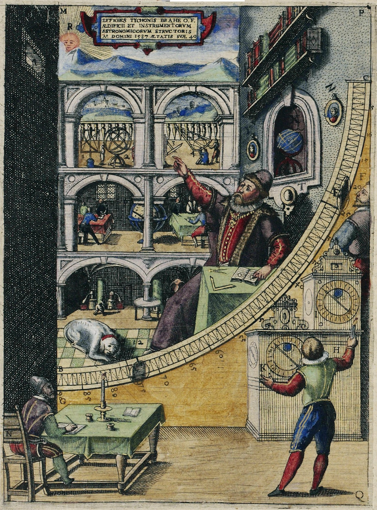

]

--

.half-list[

.red[Tycho Brahe] was a Danish nobleman, astronomer, astrologer and alchemist.

]

--

.half-list[

Built and operated first astronomical observatories where he compiled enormous amounts of accurate data on positions of stars and planets.

]

--

.half-list[

Developed hybrid geocentric/heliocentric model of solar system.

]

---
class: middle 

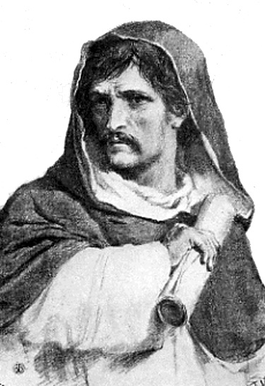

.quote-box[

"Innumerable suns exist. Innumerable earths revolve around these. Living beings inhabit these worlds."

]

---

### *Bruno's Heresy*

.pull-left[

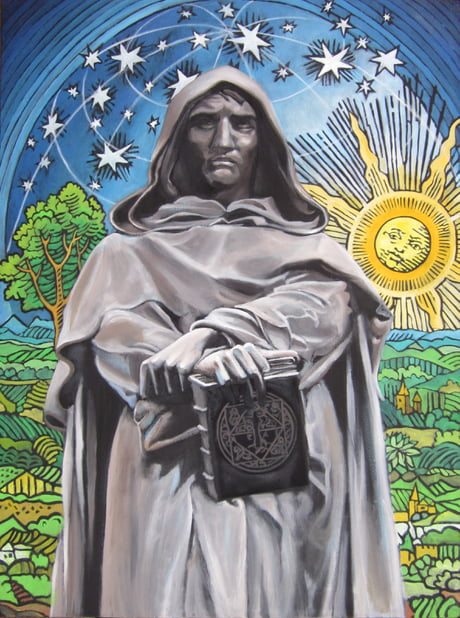

]

--

.half-list[

.red[Giordano Bruno] was an Italian mystic and monk who publicly challenged official church doctrines on the structure of the universe and religious topics.

]

--

.half-list[

First person known to suggest that stars are distant suns.

]

--

.half-list[

Tried and executed by burning as a heretic after he returned to Italy in 1600.

]

---
class: middle

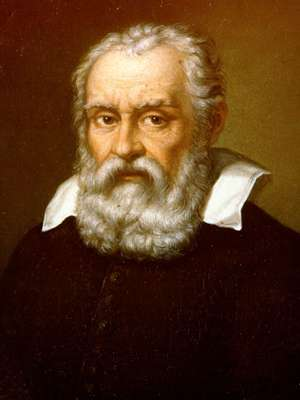

.quote-box[

"For in the sciences the authority of thousands of opinions is not worth as much as one tiny spark of reason in an individual man. Besides, the modern observations deprive all former writers of any authority, since if they had seen what we see, they would have judged as we judge."

]

---

### *Galileo's observations*

.pull-left[

]

--

.half-list[

.red[Galileo Galilei] was an Italian mathematician and astronomer who might be considered the first modern physicist.

]

--

.half-list[

Used a telescope to explore the moon, sun and planets.

]

--

.half-list[

Observed and described mountains on moon, moons of Jupiter, sunspots.

]

--

.half-list[

Forced to publicly deny his own theories or face torture and death.

]

---
class: middle

.quote-box[

"I was almost driven to madness in considering and calculating this matter. I could not find out why the planet would rather go on an elliptical orbit."

]

---

### *Kepler's models*

.pull-left[

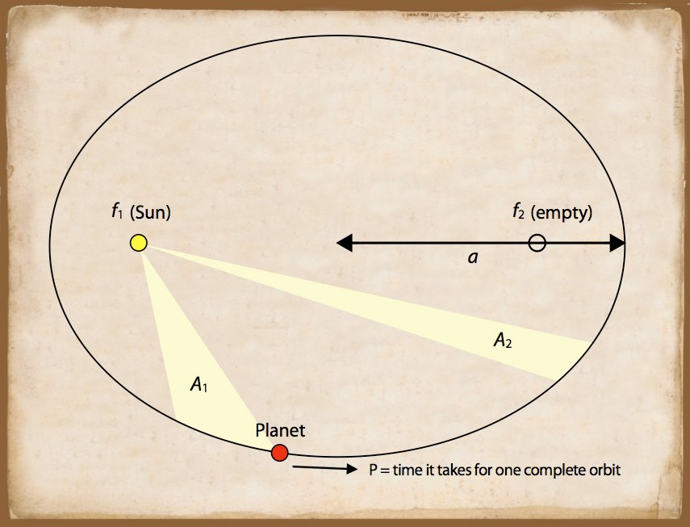

]

--

.half-list[

.red[Johannes Kepler] was an Austrian astronomer who built the first accurate mathematical model of planetary motion.

]

--

.half-list[

Showed that planets move in elliptical orbits and *not* at a uniform speed around the sun.

]

--

.half-list[

His three laws of planetary motion were derived from careful study of the data.

]

---

class: middle

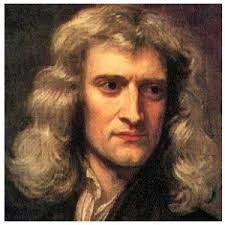

.quote-box[

"Every body continues in its state of rest, or of uniform motion in a right line, unless it is compelled to change that state by forces impressed upon it."

]

---

### *Newton's Laws*

.pull-left[

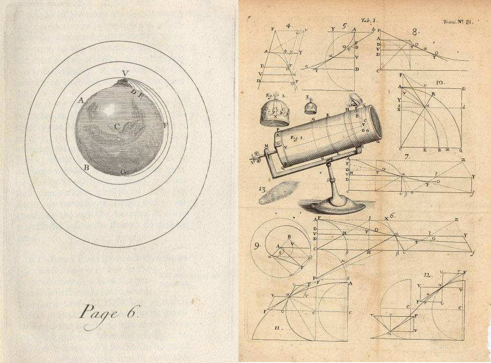

]

--

.half-list[

.red[Isaac Newton] was a British mathematician and astronomer who showed that one set of  mathematical laws governs all motion on earth and in the heavens.

]

--

.half-list[

Developed the calculus as a way to describe continuous change in the motion of bodies acted upon by forces.

]

--

.half-list[

Refused to speculate on the causes of gravitation.

]

---
class: center

.xlarge-text[*Heaven and Earth: before and after*]

.pull-left[

![:vspace 10]

]

.pull-right[

![:vspace 20]

![:vspace 25]

]

---

layout: false

## find out more

: find out more about some major figures -- those mentioned here and others as well.

: the key problem that initiated the Scientific Revolution

: a fun and mildly addictive simulator that tests your skills at building stable solar systems.

---
class: middle credits center

#### Credits

*Built with:*

 

 html presentation framework 

[download this presentation](./pdf/04-slides.pdf) or [print it](./pdf/04-handout.pdf)

