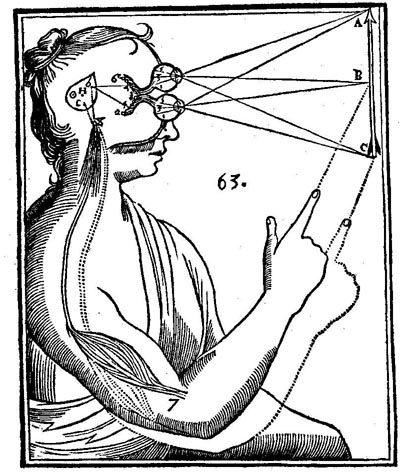
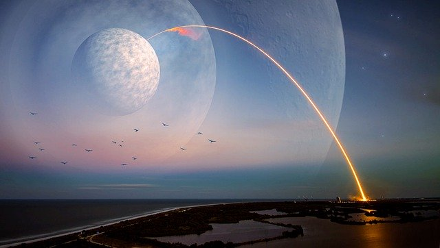

class: middle center

# *Knowledge and Observation*

### *distinguishing appearances and reality*

.small-text[George Matthews, Plymouth State University

*2020*]

---

### *a puzzle*

.pull-left[

]

---

### *Descartes Solution*

---

### *Galieo's Solution*

---

layout: false

## find out more

---
class: middle credits center

#### Credits

*Built with:*

 

 html presentation framework 

[download this presentation](./pdf/04-slides.pdf) or [print it](./pdf/04-handout.pdf)

