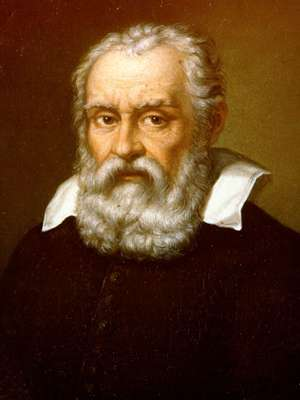

class: middle center

# *Knowledge and Observation*

### *distinguishing appearances and reality*

.small-text[George Matthews, Plymouth State University

*2020*]

---
class: middle 

.left-column[

]

.right-column[

.quote-box[

"It is now some years since I detected how many were the false beliefs that I had from my earliest youth admitted as true, and how doubtful was everything I had since constructed on this basis; and from that time I was convinced that I must once for all seriously undertake to rid myself of all the opinions which I had formerly accepted, and commence to build anew from the foundation, if I wanted to establish any firm and permanent structure in the sciences."

]

.bottomcap[*Meditations on First Philosophy*, 1641]

]

---

### *Descartes' dream*

.left-column[

]

--

.right-list[

- Our thinking about the world is .alert[representational]. 

]

--

.right-list[

- Thoughts are encoded in arbitrary symbols that need not look anything like the things they are about. 

]

--

.right-list[

- Knowing something about reality requires a reliable way of connecting thoughts to reality. 

]

--

.wide-list[

- But then how can we know anything at all with any certainty?

]

--

.wide-list[

- How can I know that I am not dreaming right now, or that reality is not entirely different than the way it seems to me?

]

---
layout: true

### *Descartes Solution*

---
--

- Find someone or something you can trust.

--

- Rely on them or it to prevent you from falling into errors.

--

- Descartes finds that he can trust his own reasoning enough to prove that God exists and that God would just not *let* him be massively deceived.

--

---

---
layout: false

.left-column[

]

.right-column[

.quote-box[

"For in the sciences the authority of thousands of opinions is not worth as much as one tiny spark of reason in an individual man. Besides, the modern observations deprive all former writers of any authority, since if they had seen what we see, they would have judged as we judge."

]

.bottomcap[Letter to Mark Wessler, 1612]

]

---

### *Galieo's clock*

.left-column[

]

--

.right-list[

- Figuring out what is happening in reality requires making accurate measurements.

]

--

.right-list[

- But how can we make accurate measurements without already having accurate measuring devices, and how can we tell that *they* are accurate?

]

--

.wide-list[

- Science describes patterns in nature and needs to distinguish real patterns from only apparent patterns.

]

--

.wide-list[

- The ultimate reality of things doesn't matter as much as being able to predict and control appearances and this is possible with methodical examination of appearances.

]

---
layout: true

### *Galieo's Solution*

---

--

- Use instruments to extend the senses.

--

- Seek experimental validation of theoretical expectations.

--

- Use multiple independent sources of information to enhance the accuracy of all.

--

---

---
layout: false

## A Practical question

.question[

Given that all sources of news might be biased, how can we figure out who to trust and what might actually be going on in the world?

]

--

- Hints: collect data, classify, corroborate 
---

class: middle center

.bottomcap[

]

---
layout: false
class: middle credits center

#### Credits

*Built with:*

 

 html presentation framework 

[download this presentation](./pdf/04-slides.pdf) or [print it](./pdf/04-handout.pdf)

