class: middle center

# *Visual Illusions*

### *seeing how the mind sees*

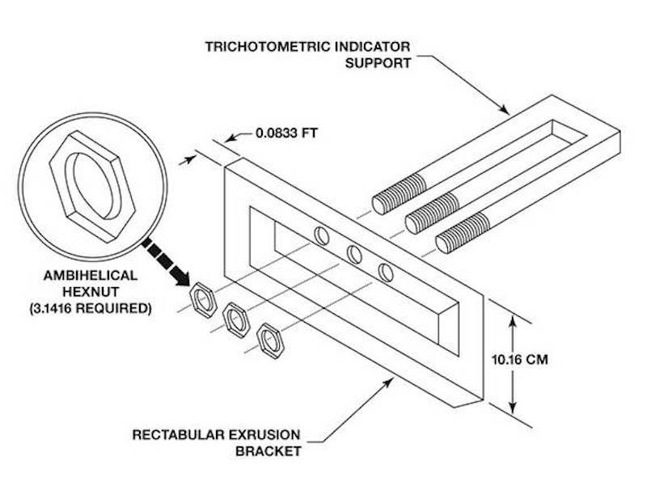

.small-text[George Matthews, Plymouth State University

*2020*]

---
### *Theories of knowledge*

--

.topcap[rationalism]

- Mind deduces the basic nature of things from fundamental concepts; knowledge results from things through carefully.

--

.topcap[empiricism]

- Mind passively recieves information from outside; knowledge requires dropping pre-concieved ideas about what things are like and letting the data speak for itself. 

--

.topcap[constructivism]

- Mind organizes raw data into a coherent picture of reality, so knowledge involves building models and testing them against new information.

---
class: middle

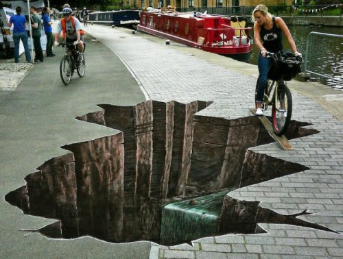

.question[

If the world that we experience is a mental construct, how does this affect our ability to know what things are really like?

]

---
layout: true

### Completing the picture

---

--

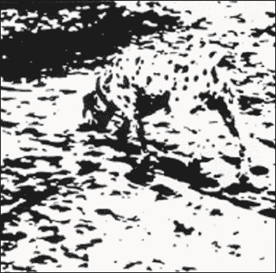

---

---

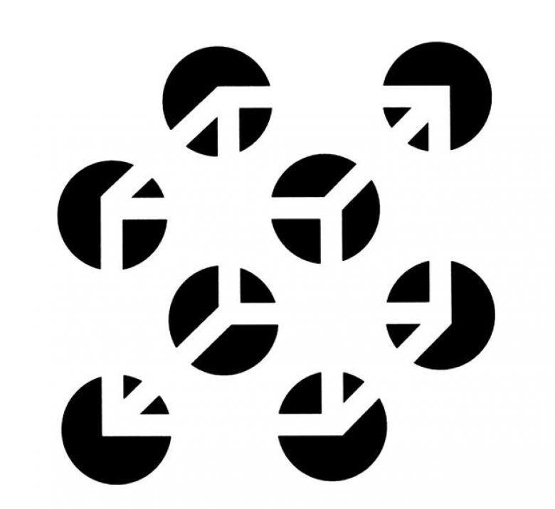

---

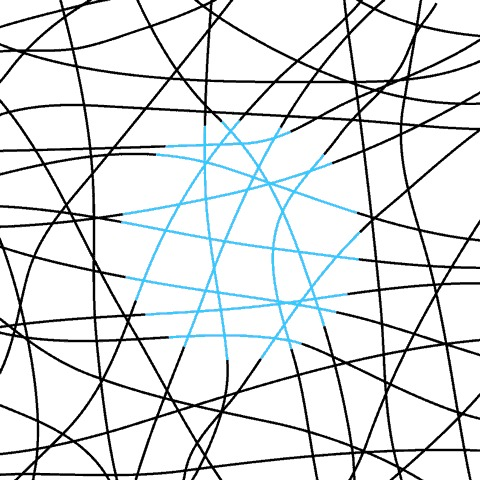

---

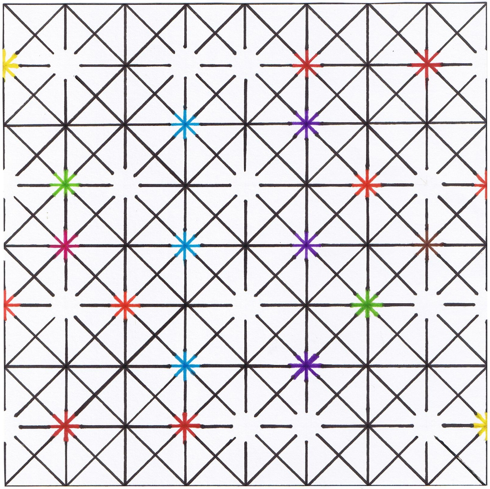

---

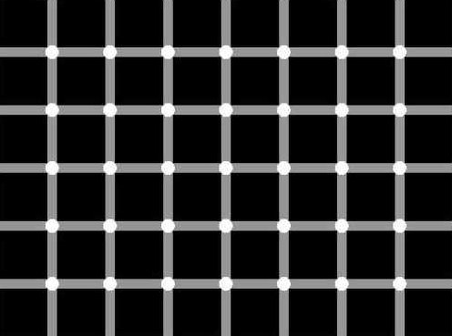

---
layout: true

### Orienting things in space

---

--

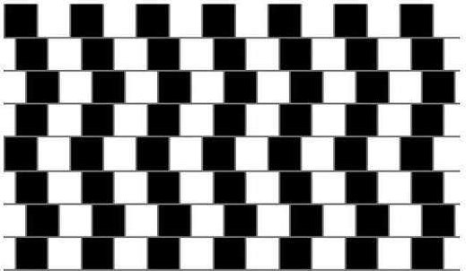

---

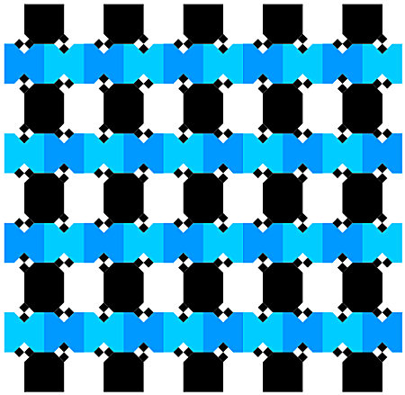

---

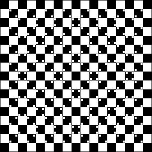

---

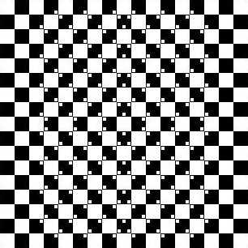

---

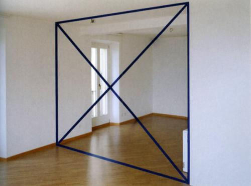

---

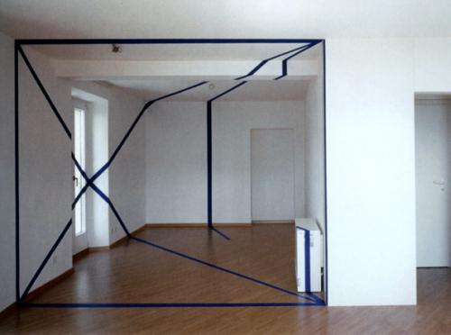

---

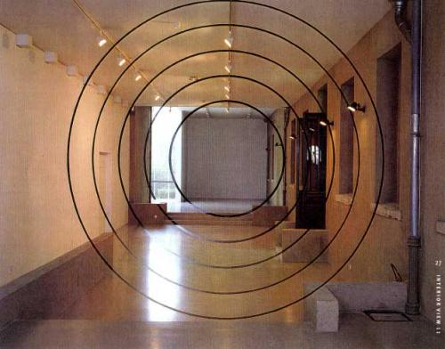

---

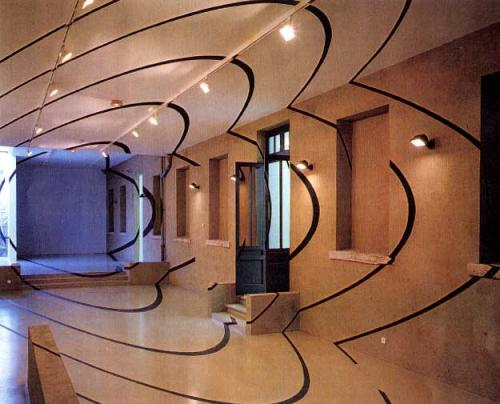

---

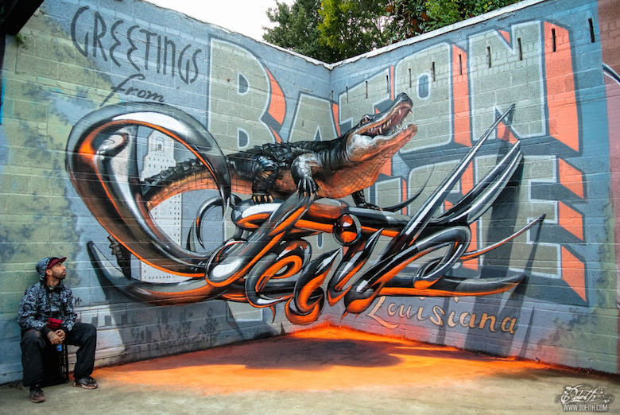

---

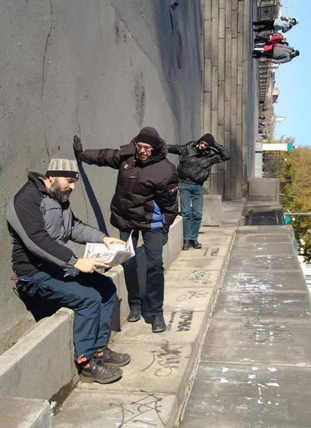

---

---
layout: true

### Interpreting objects

---

--

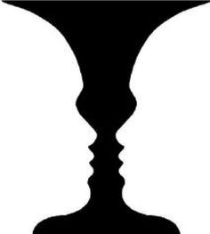

---

---

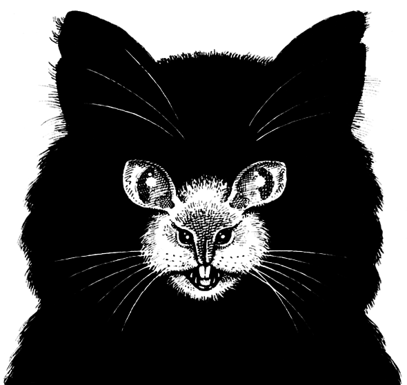

---

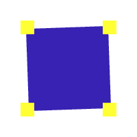

---

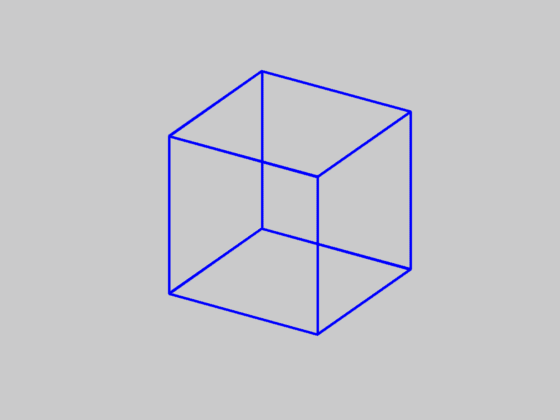

---

---

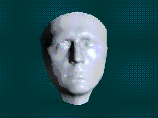

---

---
layout: true

### Perceiving motion

---

--

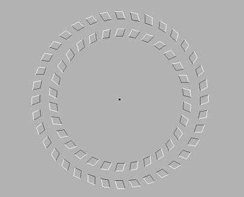

---

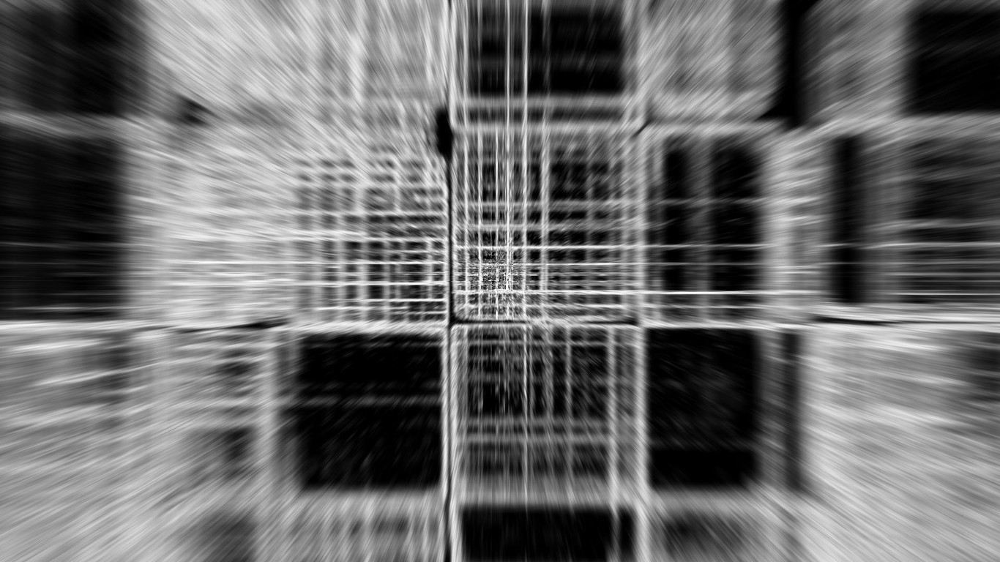

---

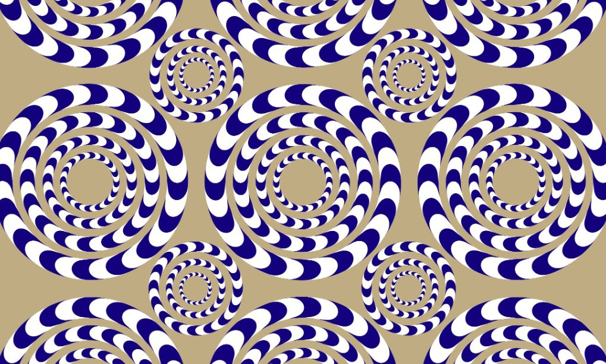

---

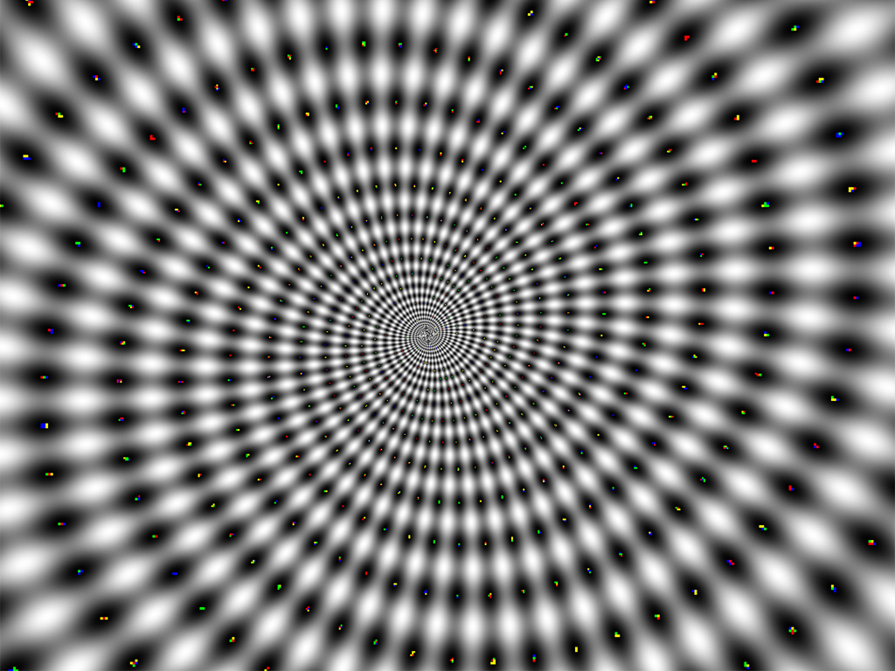

---
layout: true

### Perceiving color

---

--

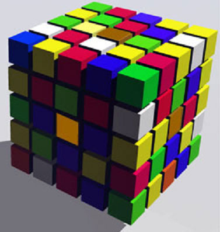

---

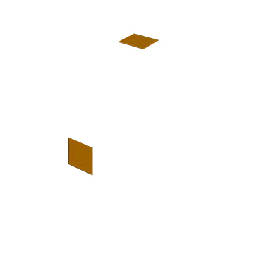

---

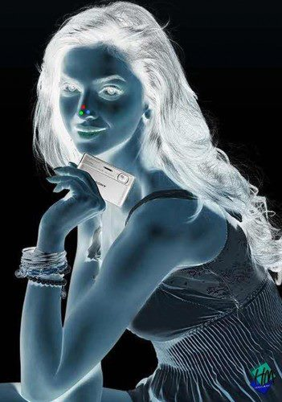

---

---

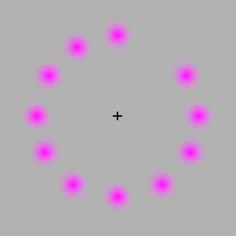

---

---

layout: false

## find out more

---
class: middle credits center

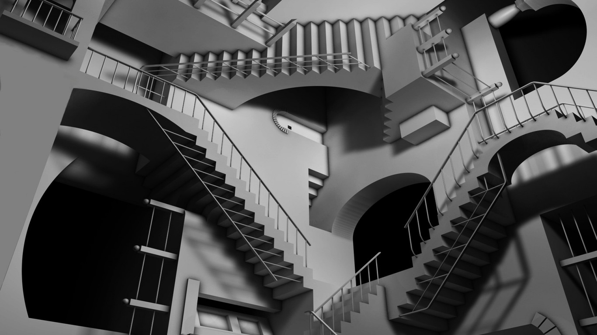

#### Credits

*Built with:*

 

 html presentation framework 

[download this presentation](./pdf/06-slides.pdf) or [print it](./pdf/06-handout.pdf)

