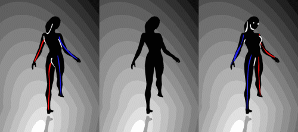

class: middle center

# *Visual Illusions*

### *seeing how the mind sees*

.small-text[George Matthews, Plymouth State University

*2020*]

---
### *Theories of knowledge*

--

.topcap[rationalism]

- Mind deduces the basic nature of things from fundamental concepts; knowledge results from thinking things through carefully.

--

.topcap[empiricism]

- Mind passively recieves information from outside; knowledge requires dropping pre-concieved ideas about what things are like and letting the data speak for itself. 

--

.topcap[constructivism]

- Mind organizes raw data into a coherent picture of reality, so knowledge involves building models and testing them against new information.

---
class: middle

.question[

If the world that we experience is a mental construct, how does this affect our ability to know what things are really like?

]

---
layout: true

### Completing the picture

---

--

--

.wide-list[
*HINT: Can you see the dog?*
]

---

--

.wide-list[
*Is there a white triangle here or not?*
]

---

--

.wide-list[
*Are you looking up at the bottom of the cube or down at the top?*
]

---

--

.wide-list[
*Our visual systems soften the differences between contrasting elements if they seem to evoke a pattern.*
]

---

--

.wide-list[
*Why does the color of the intersections change depending on whether you are looking straight at them or not?*
]

---

.wide-list[
- Our minds are "anticipation engines" -- we identify patterns and use them to anticipate what happens next in time, space or action.
]

--

.wide-list[
- By default we leap to conclusions only later filtering them through critical thinking.
]

--

.wide-list[
- The ease with which we can connect the dots enables us to thrive in complex and novel environments.
]

--

.wide-list[
- It also leaves us vulnerable to seeing patterns that aren't really there.
]

---
layout: true

### Orienting things in space

---

--

--

.wide-list[
*All horizontals are parallel. Check it with  ruler! Why can't we SEE this even though we KNOW it?*
]

---

--

.wide-list[
*A more extreme case of how we interpret visual data spatially in response to  small contextual cues.*
]

---

--

.wide-list[
*Changing these cues...*
]

---

--

.wide-list[
*... changes our spatial perception.*
]

---

--

.wide-list[
*Sometimes an illusion depends on...*
]

---

--

.wide-list[
*... us occupying one particular perspective.*
]

---

--

.wide-list[
*Only from such a perspective can we see the illusion.*
]

---

--

.wide-list[
*It falls apart with a simple change of viewpoint.*
]

---

--

.wide-list[
*Some artists specialize in tricking our minds into rendering flat images as 3-dimensional objects.*
]

---

--

.wide-list[
*Or creating ambiguous scenes.*
]

---

.small-text[
*The Ames room is an illusion relies on our senses having been "tuned up" to expect parallel walls, floors and details in interior spaces.*
]

---
layout: true

### Interpreting objects

---

--

--

.wide-list[
*We often have choices about which mental model best captures the reality.*
]

---

--

.wide-list[
*We can flip from seeing this as a duck to seeing it as a rabbit at will.*
]

---

--

.wide-list[
*Often unconscious "decisions" enable us to structure input as a coherent and meaningful image or scene.*
]

---

--

.wide-list[
*Context can determine how we perceive motion and change.*
]

---

--

.wide-list[
*Are we looking down at the top or up at the bottom of tis cube and which way is it rotating anyway?*
]

---

--

.wide-list[
*Subtle visual cues on the side dancers cause the direction of rotation to change.*
]

---

--

.wide-list[
*Since we never see behind anybody else's face we can't see the back of the mask as hollow. Our brains compensate by switching direction of apparent motion.*
]

---

--

.wide-list[
*When exactly do figure and ground reverse?*
]

---
layout: true

### Perceiving motion

---

--

--

.wide-list[
*Focus on the dot in the middle and move year head back and forth. What do you notice?*
]

---

--

.wide-list[
*Some static images suggest motion with patterns of distortion and displacement.*
]

---

--

.wide-list[
*When our eyes see motion but our bodies register stillness we can feel ill....*
]

---

--

.wide-list[
*... This is because we evolved to associate this mismatch with poisoning, which often results in perceptual/motor disconnects. Consider the effects of alcohol.*
]

---
layout: true

### Perceiving color

---

--

--

.wide-list[
*Are the center squares on the faces in the light and the shadow different colors...*
]

---

.wide-list[
*...or the same color?*
]

---

--

.wide-list[
*Stare at the colored dots on her nose for 30 seconds then go to the next slide while holding your eyes still.*
]

---

--

.wide-list[
*What did you just see?*
]

---

--

.wide-list[
*Image and after-image are opposite colors which cancel each other out. What happens when you fix your gaze on the plus sign in the middle?*
]

---

--

.wide-list[
*We wouldn't be done  here without "The Dress That Broke The Internet" in 2017. It is of course colored white and gold.*
]

---

layout: false

## find out more

- : explores some of the mechanisms behind the scenes.

- : lots of examples and explanations of the causal mechanisms.
---
class: middle credits center

#### Credits

*Built with:*

 

 html presentation framework 

[download this presentation](./pdf/06-slides.pdf) or [print it](./pdf/06-handout.pdf)

