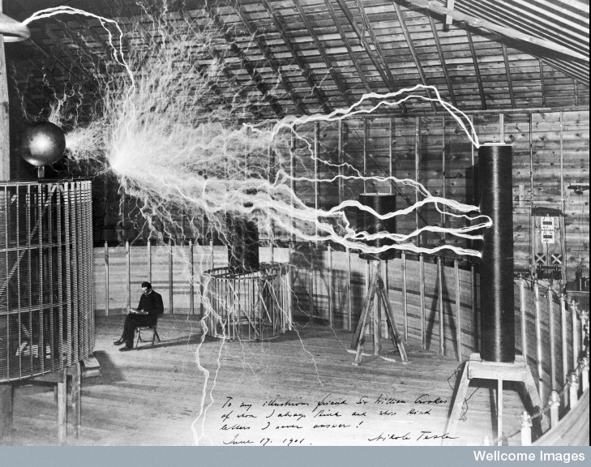

class: middle center

# *Matter and Energy*

### *The Second Scientific Revolution*

.small-text[George Matthews, Plymouth State University

*2020*]

---

![:vspace 20]

Even though the Scientific Revolution was complete by the end of the 18th Century, science had not yet had much impact on ordinary people's lives.
---
layout: true

### *Accomplishments of the Scientific Revolution*

---

- Development of experimental methods -- formulation and testing of empirical hypotheses.

---

- A comprehensive mathematical model of mechanical and gravitational motion.

---

- Establishment of scientific societies devoted to the development and publication of scientific findings.

---

- A growing body of observational data in many areas as Europeans colonized and explored the rest of the world.

---
layout: true

### *Unknowns in 1800*

---

- What are material things made of?

---

- How do chemical reactions work?

---

- What is electricity?

---

- What is magnetism?

---

- What is the difference between animate and inanimate things?

---

- What is heat and why does it make some processes happen faster?

---

These questions would all be answered in the 19th Century with the development of scientific understanding of the material world.

The result...

---
layout: false

### *The Industrial Revolution*

![:vspace 20]

Scientific understanding of matter and energy would transform the world as never before in less than a century.

---

---

---

layout: false

## find out more

---
class: middle credits center

#### Credits

*Built with:*

 

 html presentation framework 

[download this presentation](./pdf/06-slides.pdf) or [print it](./pdf/06-handout.pdf)

