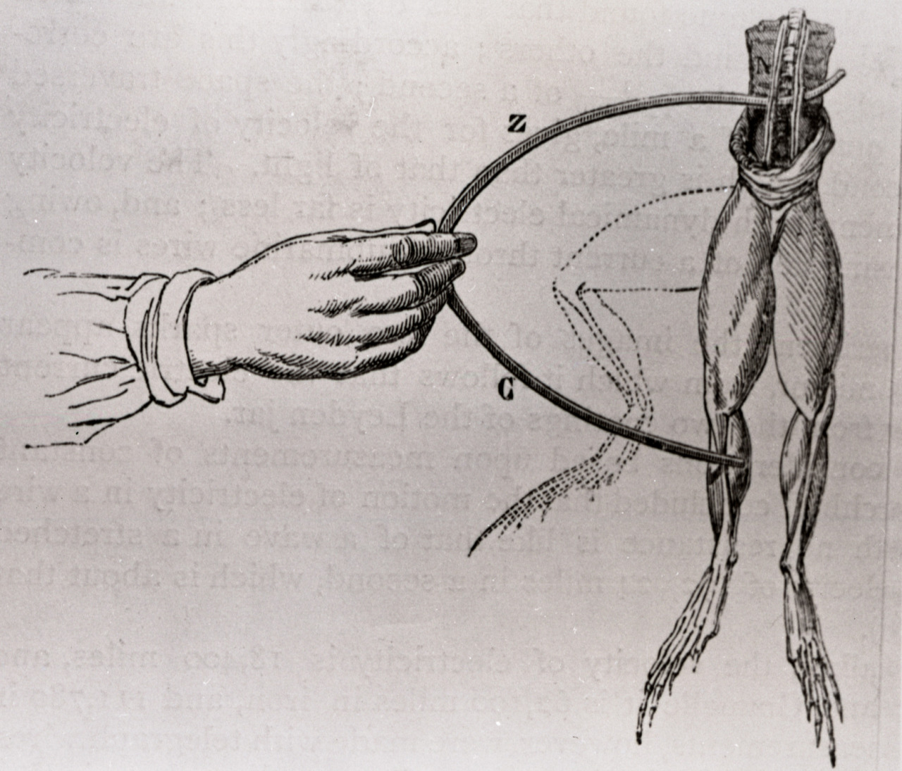

class: middle center

# *Matter and Energy*

### *The Second Scientific Revolution*

.small-text[George Matthews, Plymouth State University

*2020*]

---

![:vspace 20]

Even though the Scientific Revolution was complete by the end of the 18th Century, science had not yet had much impact on ordinary people's lives.
---
layout: true

### *Accomplishments of the Scientific Revolution*

---

- Development of experimental methods -- formulation and testing of empirical hypotheses.

---

- A comprehensive mathematical model of mechanical and gravitational motion.

---

- Establishment of scientific societies devoted to the development and publication of scientific findings.

---

- A growing body of observational data in many areas as Europeans colonized and explored the rest of the world.

---
layout: true

### *Unknowns in 1800*

---

- What are material things made of?

---

- How do chemical reactions work?

---

- What is electricity?

---

- What is magnetism?

---

- What is the difference between animate and inanimate things?

---

- What is heat and why does it make some processes happen faster?

---
layout: false

These questions would all be answered in the 19th Century with the development of scientific understanding of the material world.

--

.topcap[The result...]

--

![:vspace 20]

--

Scientific understanding of matter and energy would transform the world as never before in less than a century.

---
layout: true

### *Understanding electricity*

---

--

- Jean-Antoine Nollet builds electrostatic generators, shocks 800 monks in demonstration.

---

--

- Luigi Galvani accidentally discovers that nerves are activated by electrical impulses.

---

--

- His followers think he has discovered the "animal electricity" that all living beings posses.

---

--

- Among those influenced was Mary Shelley whose novel *Frankenstein* assumed that dead tissue could be revitalized with electrical shocks.

---

--

- Alessandra Volta creates first battery based on his understanding of why the frog's leg twitched when touched with dissimilar metals.

---

--

- Michael Faraday creates first electric generator by building a device that moves a conductor through a magnetic field.

---

layout: true

### *Understanding matter*

---

--

- Humphrey Davy uses electric currents to isolate many elements such as sodium, lithium and potassium.

---

--

- Dmitri Mendeleev formulates first periodic table of the elements based on the findings of many chemists about how different sets of elements interact with each other to form compounds.

---

layout: true

### *Understanding life*

---

--

- Theodore Schwann and Matthias Schleiden develop the first cellular theory of life.

---

--

- Charles Darwin develops his theory of Evolution by Natural Selection as the first comprehensive theory explaining the variety and adaptations of life on earth.

---
layout: false

### *Connections*

- Energy is the ability to do work or make things happen.

- It comes in many forms: mechanical, thermal, chemical, electrical all of which can be converted into each other.

- Electricty is moving electrons, and can be generated chemically and mechanically.

- Heat is the average kinetic energy of moving bits of matter.

- Chemical reactions involve sharing or exchange of electrically charged particles.

- Biological cells are biochemical machines that take into energy, grow reproduce and move themselves.

---

class: middle credits center

#### Credits

*Built with:*

 

 html presentation framework 

[download this presentation](./pdf/07-slides.pdf) or [print it](./pdf/07-handout.pdf)

