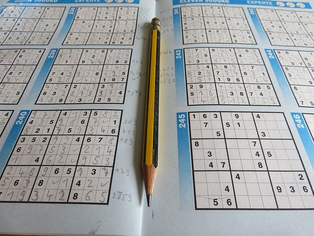
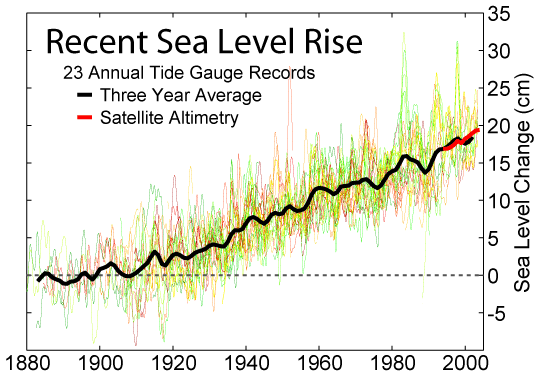
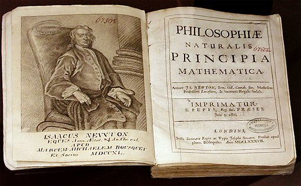

class: middle center

### *A Little Logic*

*arguments, reasoning and proof*

George Matthews, Plymouth State University

*2020*

---
layout: true

### *What do I know?*

 

---

.left-column[

#### .lightgray[Knowledge is]

#### .darkgray[justified,]

#### .darkgray[true.]

#### .darkgray[belief.]

]

.right-column[

]

---

.left-column[

#### .lightgray[Knowledge is]

#### .darkgray[justified,]

#### .darkgray[true.]

#### .red[belief.]

]

.right-column[

.example[

- How can we know anything at all? This ancient philosophical question has troubled many people.

- First, note that knowledge is a state of mind, a type of *belief.* But there's more to knowledge than belief.

]]

---

.left-column[

#### .lightgray[Knowledge is]

#### .darkgray[justified,]

#### .red[true,]

#### .lightgray[belief.]

]

.right-column[

.example[

- To count as knowledge our beliefs have to be *true.* 

- While it may be hard to figure out just what the facts are, simply believing something strongly is not enough to make it true. 

]]

---

.left-column[

#### .lightgray[Knowledge is]

#### .red[justified,]

#### .lightgray[true,]

#### .lightgray[belief.]

]

.right-column[

.example[

- Finally we need *justification* for anything to really count as knowledge since knowledge is more than just lucky guessing. 

- How we can justify our claims is one of the concerns of logic.

]]

---
layout: false
layout: true

### *Reasoning & logic*

---

.pull-left[

#### deduction

- Deductive logic is the logic of *proof*. 

- It shows what else can we figure out based on what we already know.

- Deductive reasoning demonstrates the necessary consequences of given information.

]

--

.pull-right[

.note[Sudoku puzzles are pure deduction, no guesswork is required.]

]
---

.pull-left[

#### induction

- Inductive logic is the logic of *data analysis*. 

- It shows what is likely to be true given the data that we have.

- In spite of inductive reasoning being weaker than proof we rely on this kind of reasoning every day.

]

--

.pull-right[

.note[Probability theory and statistics enable us to make reliable guesses with incomplete information.]

]

---

.pull-left[

#### abduction

- Abductive reasoning is reasoning about the *best explanation* for something.

- It (tries to) show why one way of explaining the facts is better than other ways.

- One explanation is typically better than another when it is simpler and has more predictive power.

]

--

.pull-right[

.note[Scientific progress happens when scientists come up with better explanations. Isaac Newton did just that when he showed how all motion in the heavens and on earth followed a few basic laws.]

]

---

layout: false
layout: true

### *Basic concepts*

.argument[
All humans are mortal.

Socrates is human.

***

Thus Socrates is mortal.
]

---

![:vspace 30]

--

This simple argument has two **premises** and a **conclusion**.

--

.double[The premises are the information we start out with and the conclusion is what we claim *logically follows from* that information.]

---

![:vspace 30]

We'd like to know two things about it:

--

1. Is it .red[VALID]? Does the reasoning work?

--

2. And if so is it .red[SOUND]? Is the information in the premises true?

---

![:vspace 30]

So is this argument VALID?

--

- To check we *assume* that the premises are **TRUE** (don't worry we'll get rid of that assumption later).

--

- Is it possible for the premises to be **TRUE** and the conclusion **FALSE**?

--

- If not, then the argument is .red[VALID], as this one clearly is.

---

![:vspace 15]

So if it's VALID we then want to know whether it's SOUND.

--

- Since a SOUND argument is a VALID one with true premises, we now get rid of our original assumption and check to see if they are true.

--

- In this case they are -- All humans *are* mortal, and Socrates was one.

--

- So this argument is .red[SOUND]!

---
layout: false
layout: true

### *More examples*

---

.argument[
All cats are animals.

My brother is an animal.

***

Thus my brother is a cat.
]

--

Once again we start with an *assumption* -- let's suppose that the premises are TRUE.

--

- Does the conclusion **have to be true** as well?

--

- Clearly not, just ask him. Sound it is INVALID and thus also UNSOUND.

--

- The premises here refer to three *different* categories which are related in some way, but not in the way the conclusion states.
 
---

.argument[
All cats are fish.

All fish are made of wood.

***

Thus all cats are made of wood.
]

--

![:vspace 15]

If the premises *were* true would the conclusion *have to be true* as well?

--

- Yes, so it is .red[VALID].

--

- If cats were part of the larger class "fish" and fish were themselves part of a larger class "things made of wood" then cats would have to be made of wood. (This is a mini PROOF of validity, more on that later.)
 
---
layout: false

### *Proving validity*

.example[

Either Fred or Betty killed Mr. Slate at the quarry.

Either Fred or Wilma were home since somebody let Dino in.

But Wilma was working late.

***

So Betty killed Mr. Slate.

]

--

Assuming the premises are TRUE, we can prove the conclusion like so:

--

> Fred must have been home -- this follows from the second and third premises, since Wilma was out and either Fred or Wilma was home. But then the only way for the first premise to be true is if Betty killed Mr. Slate, which is the conclusion.

--

.note[note: Even though the argument is VALID it is not SOUND, since it is a  *fictional* case.]

---

### *Counterexamples*

--

.example[

Betty is older than Barney and younger than Fred.

Wilma is younger than Fred.

***

Thus Betty is younger than Wilma.

]

--

.pull-left[

To show that an argument is INVALID we have to show that the conclusion *might* be false even if the premises were true. 

Its easier then it seems -- in this case we just find some ages that make the premises TRUE and the conclusion FALSE.

]

--

.pull-right[

.center[a counterexample]

|  person   | age  |
|:---------:|:----:|
| Barney    |  35  |
| Betty     |  40  |
| Fred      |  45  |
| Wilma     |  38  |

]

---

### *Conditional reasoning*

--

Which cards MUST be flipped over to determine whether the following rule is true?

--

.topcap[

If there is an odd number on one side, there is a vowel on the other side.

]

--

---

### *Conditional reasoning*

--

Whose hand or drink  must you check cards MUST be flipped over to determine whether the following rule is being violated? 

(**X on hand means under 21.**)

--

.topcap[

If you are under 21, you are not allowed to drink alcohol.

]

--

---
layout: true
### *More examples*

![:vspace 80]

---

--

.argument[

If the moon is full, more people do crazy things.

The moon is full tonight.

***

So more people will do crazy things.

]

---

.argument[

If many children are not vaccinated against measles, measles outbreaks will occur.

Many children are not being vaccinated against measles.

***

Thus measles outbreaks will occur.

]

---

.argument[

The earth is at the center of the universe. This is because if it were at the center, the sun would appear to travel across the sky, which it does.

]

---

.argument[

If the earth were at the center of the universe, the sun would appear to travel across the sky.

The sun does appear to travel across the sky.

***

Thus the earth is at the center of the universe. 

]

---

.argument[

If you were abducted by aliens you would remember it. 

Betty and Barney remember being abducted by aliens.

***

This proves that they were abducted by aliens as they have claimed.

]

---

.argument[

If the earth were really moving we would feel it moving.

But we don't feel it moving.

***

So it is not in fact moving.

]

---

.argument[

If the Loch Ness monster existed there would have to be hundreds of them.

If there were hundreds of them sightings would be frequent, somebody would have gotten a good video or we would have captured one by now.

But none of these things have happened.

***

So it does not exist.

]

---

.argument[

If her Zener card results were significantly better than what we'd expect from chance alone, she would have ESP.

Her Zener cards results were NOT better than what we would expect from chance alone.

***

So she doesn't have ESP.

]

---

.argument[

If you had these symptoms you might have the disease.

I do not have those symptoms.

***

Thus I do not have the disease.

]

---
layout: false
class: medium-text

### *Glossary*

- **Argument**: a series of statements in which the premises are intended to logically support the conclusion.

- **Valid**: an argument is valid when it is impossible for the premises to be true and the conclusion false.

- **Sound**: an argument is sound when it is valid and has true premises.

- **True**: said only of statements, not of arguments, and surprisingly hard to define.

- **False**: the opposite of true and once again said only of individual statements, not arguments.

- **Proof**: a step by step demonstration of the validity of an argument. In a proof we spell out exactly how we can derive the conclusion from nothing but the information contained in the premises.

- **Counterexample**: a possible case in which the premises of an argument are true and the conclusion is false -- used to show that an argument is invalid.

---

### *Find out more*

: A great site with over 100 free tutorials on many aspects of logic and critical thinking. A nice way to hone your logical thinking skills.

: An in depth look at the subject at the Internet Encyclopedia of Philosophy.

: A close look at the logic of scientific explanation. Gets technical, but the introduction is accessible.

: Michael Huemer is a professor of philosophy at the University of Colorado. This TED Talk by him addresses the question of why we are so irrational when it comes to politics.

---
class: center credits

.credit-image[

]

#### Credits

*Built with:* 

 html presentation framework 

*Images by:*

, ,  and  at Pixabay

[download this presentation](./pdf/08-slides.pdf) or [print it](./pdf/08-handout.pdf)

: requires a (free) GitHub account.
