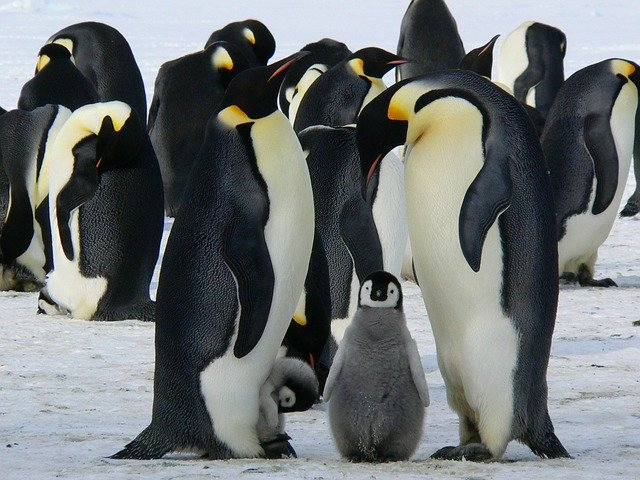

class: middle center

### *Evolution*

*explaining life*

George Matthews, Plymouth State University

*2020*

---
layout: true

### *Life on Earth*

---

---

---

---

---

---

 
---

---

---

---

---

---

---

---

---

---

---

---
layout: false
class: middle

.question[

.xlarge-serif[

- Explaining is a form of storytelling, but what is the difference between scientific and other forms of storytelling? 

- Why should we take scientific stories more seriously than other modes of storytelling? 

]

]

---
layout: false

### *Scientific Explanation*

--

.argument[

To explain something scientifically is to give an account of its .red[CAUSES], in a way that shows .red[WHY] it happened and that enables the .red[PREDICTION] of what will happen in similar cases.

]

--

.topcap[The best explanations are...]

--

.argument[

- **Testable**: they might turn out to be wrong.

- **Fruitful**: they lead to surprising but true predictions.

- **Broad in scope**: they account for many phenomena.

- **Simple**: they avoid too many assumptions.

- **Conservative**: they do not conflict with established truths.

]

---

### *Assumptions before Darwin*

.argument[

- Living things are not just made of matter -- they also have a "vital spark," that distinguishes them from inanimate things.

- Species do not go extinct or change over time.

- The Biblical story of creation of the earth and all organisms is basically true.

- The earth is a few thousand years old.

- Large scale geological features of the earth like mountain ranges, continents, rivers and oceans have not changed very much since they were formed.

]

---
### *Paley's Watch*

.left-column[

]

--

.right-argument[

If you found a watch on the beach you'd be right to think it was not a product of chance but of design.

The organisms we "find" in nature are even more complex than a watch.

***

Thus all living organisms must have been designed and not be a result of the blind forces of nature operating at random.

]

--

.wide-list[

Paley thought that the **best explanation** for the variety and adaptations of living organisms was that they had been designed by God, but he also considered this argument a proof that God does in fact exist.

]

---

### *The Facts of Life*

--

.topcap[A scientific account of life on earth has to explain:]

--

.argument[

- The difference between living and non-living things.

- The huge variety of living organisms.

- Their adaptations to their environments.

- The patterns of their distribution around the globe.

- The ways they can be grouped -- by common forms, habitats, ways of living, etc.

- The patterns among their fossil remains.

]

---
layout: true

### *Darwin's Voyage*

---

--

---

---

---

---

---

---

---
layout: false

### *Darwin's Big Idea*

.topcap[Evolution by natural selection]

.argument[

If you start out with a population of living organisms,

- and their offspring have a natural source of **variation** ...

- and they **compete** for food, safety and mates...

- and their variability is **inherited** by *their* offspring,

Over time they will diversify, giving rise to new species.

Given enough time this can account for enormous variety and adaptations of life on Earth.

]

---

class: center credits

.credit-image[

]

#### Credits

*Built with:* 

 html presentation framework 

[download this presentation](./pdf/11-slides.pdf) or [print it](./pdf/11-handout.pdf)

: requires a (free) GitHub account.

