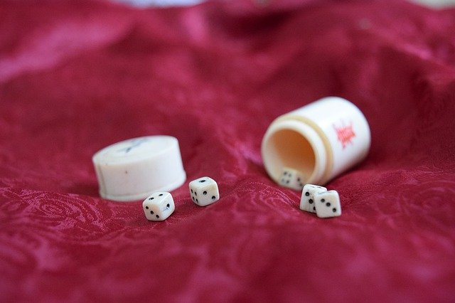
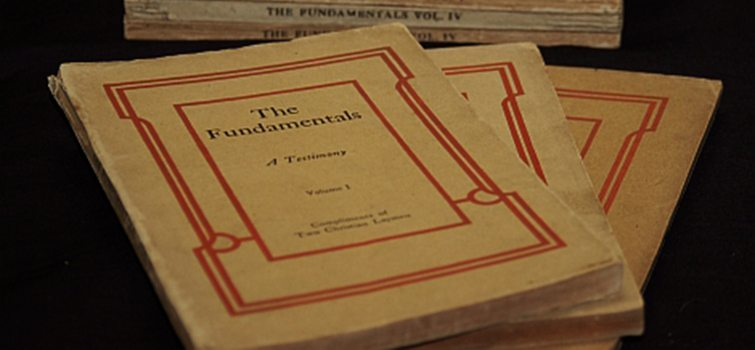
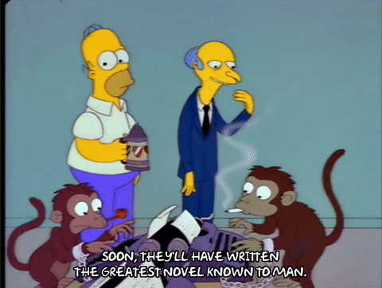
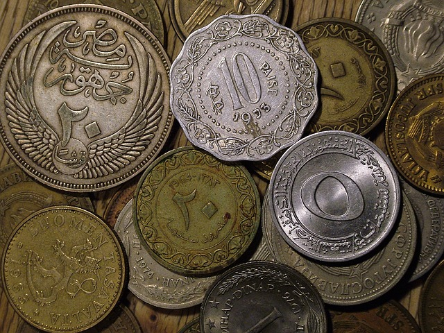

class: middle center

### *Rolling the Dice*

*evolution, chance and design*

George Matthews, Plymouth State University

*2020*
---
background-image: url(img/12/biodiversity.jpg)
background-size: contain

---

### *Darwinian Evolution*

--

.topcap[Descent with Modification]

.argument[

1. Start with some self-replicating simple organisms.
2. Copy them with slight variations.
3. Allow them to compete for food, shelter and mates.
4. Repeat 10 gazillion times.

]

--

- That is all we need to account for the staggering diversity and exquisite adapation of life on Earth.

--

- Genetics and molecular biology provide mechanisms for this process.

--

- With minor adjustments the theory of evolution by natural selection remains the basis of modern biology.

---
background-image: url(img/12/tree-of-life.jpg)
background-size: contain

---
background-image: url(img/12/human-tree.jpg)
background-size: contain

---

### *Objections to Evolution*

--

.argument[

1*.* It's just an automated procedure (an algorithm) and yet its results seem so creative and intelligent.

2*.* How can randomness lead to the solution of real-world problems in a reasonable amount of time?

3*.* Doesn't this theory undermine human dignity and the meaning of our lives?

]

---
### *Modern religious fundamentalism*

--

Response to two developments in 19th century science.

--

.argument[
1. Darwin's theory of evolution which did away with the idea that God was needed as a creator of life.

2. Modern Biblical scholarship which looked at the Bible as a collection of ancient literature and not as God's eternal and unchanging word.
]

---
class: center 

### *How many monkeys would it take to write a novel?*

--

--

---

### *The Gambler's Fallacy*

.argument[

"I just flipped five heads in a row, so there must be a higher probability of tails coming up next."

]

---

### *The Hot Hand Fallacy*

.argument[

"Get her the ball quick, she is shooting way above her average today -- she is on fire!"

]

---
class: wide-text

10110101 00111011 11011101 11101001 11011111 11010111 00110111 11010010 
00011001 01101101 10100110 00110110 01110110 01000100 11111011 11011010 
11010000 01001111 10011001 00010010 11001111 10100110 01011100 11101111 
00100111 11001010 11110100 11011111 00111010 01101010 01000100 10111101 
00101011 01011100 01000001 00000111 11001001 01110101 01110001 11010100 
11011110 10100011 11101110 10101000 01100010 10010001 01011100 11000111 
01100000 11100001 00011000 10001100 01110110 00100101 11100111 10110101 
10010001 11011000 11010001 11111100 10110011 00010001 11001101 01011000 
10001100 10001100 01010000 10110101 01101110 00101001 00010110 00010001 
01011001 11101100 01101011 11011011 11110001 01101011 11000001 00001111 
11101000 10000011 01011001 01111101 01011000 11111111 11110110 01111110 
01101110 11101100 10100101 10111101 01101001 00010000 01011011 01000010 
01010010 11011101 11111100 11000001 01001100 00101111 11101111 01011011 
10110101 00011011 00011111 10011000 01111011 11110010 10101001 00011000 
10000000 01011110 11110101 11010111 10101001 10010110 00001100 00010010 
11101100 10011100 10110111 11000011 00100101 11011001 01110011 11011000 
10010111 11001100 00010111 00000110 11000111 10110010 00100011 01100011 
00111110 00001111 11101101 10011110 10000011 10000111 01011110 00110010 
01010001 01100010 01011001 01000110 01000101 10001011 11000011 10111010 
10010001 11101000 11101111 10110010 11111110 00001001 01000100 01011101 
10001001 01010001 11101101 10010001 01111100 00011110 11011100 00111001
11101111 10101101 10010000 

---

### *The Tough love Fallacy*

.argument[

When the team plays exceptionally well and I praise them afterwards, they don't play as well in the next game.

When the team plays really poorly and I scream at them in the locker room afterwards, they play better next time.

***

So positive reinforcement fails and negative reinforcement works.

]

---

### *The Monty Hall problem*

Behind one door is a new car, behind the other two are goats.

.argument[

- You picked door number one.

- Monty shows you the goat behind door number two.

- Should you switch to door number three when given the choice?

]

---

class: center credits

.credit-image[

]

#### Credits

*Built with:* 

 html presentation framework 

[download this presentation](./pdf/11-slides.pdf) or [print it](./pdf/11-handout.pdf)

: requires a (free) GitHub account.

