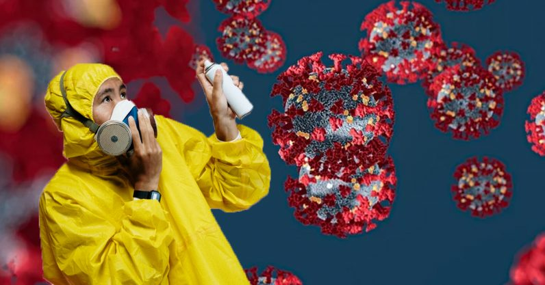

class: middle center

### *Conspiracy Theories*

*Too Many Connections*

George Matthews, Plymouth State University

*2020*

---
layout: true

### *The Puzzle of Conspiracy Theories*

---

- They enjoy widespread and growing support and yet have little evidence in favor of them.

---

- They are predictable in their emergence in times of crisis and great social stress.

---

- They are individually easy to debunk or disprove, even as they seem impossible to combat on a wider scale.

---

- They are dangerous since they amplify inter-group hostility, encourage violence and subvert efforts to deal with social problems.

---
layout: true

### *Approaches to Conspiracy Thinking*

---

.topcap[1*.* Accept them.]

---

.topcap[2*.* Debunk them one at a time.]

---

.topcap[3*.* Accept relativism about them.]

---

.topcap[4*.* Try to explain them.]

---

layout: true

### *Elements of Conspiracy Thinking*

---

.wide-list[

- Search for control and meaning in a world out of control and confusing.

]

---

.wide-list[

- Someone is to blame and we can thus do something about our predicament.

]

---

.wide-list[

- Symbolic connnections, hidden meanings, deep significance of events, invisible agents -- these ideas resonate with magical thinking and come naturally to us.

]

---

.wide-list[

- Common narrative: there is a nefarious plot, organized by a secret elite, which most people don't see or suspect, but I have figured it out and now they are trying to kill me.

]

---

layout: false

### *Another Puzzle*

---

### *The Criminal Element*

---

---

### *Find out more*

---

class: center credits

.credit-image[

]

#### Credits

*Built with:* 

 html presentation framework 

[download this presentation](./pdf/11-slides.pdf) or [print it](./pdf/11-handout.pdf)

: requires a (free) GitHub account.

