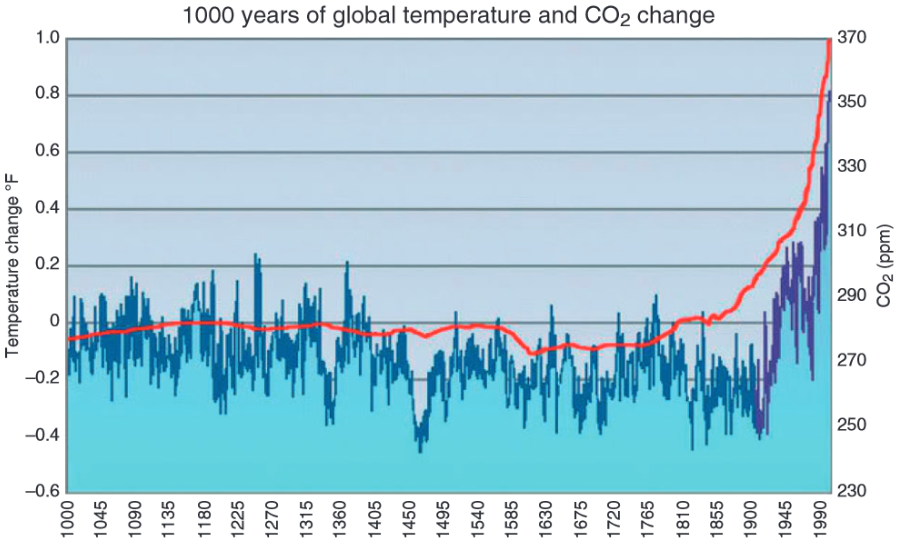

class: middle center

### *Science Denial*

*a case of misplaced skepticism*

George Matthews, Plymouth State University

*2020*

---

---

### *Many Forms of Climate Change Denial*

--

.argument[

1*.* The Earth's climate is not in fact changing and the evidence does not support that it is.

*variation*: Evidence that it is changing is fraudulent.
]

--

.argument[

2*.* It is changing but the change is natural and not caused by us.

]

--

.argument[

3*.* It is caused by us, but it is a bad idea to try to stop it.

*variation*: Maybe it is even a good thing that it is happening!

]

---

### *Some questions*

.question[

How can we tell the difference between good and bogus claims to scientific knowledge?

]

--

.question[

 Does science depend on a single method, and if not does "anything go?"
 
 ]

--

.question[

 Why should we trust scientific findings and how is this trust different than faith?
 
 ]

---

### *The Hypothetico-Deductive Method*

.argument[

If this .red[theory] is true, then this .red[consequence] should happen.

The .red[consequence] does happen.

***

Therefore the .red[theory] is true.

]

--

--

The fallacy of affirming the consequent.

---

### *Validation?*

.argument[

If vitamin C cures colds, then you should feel better after taking Vitamin C.

I do feel better after taking Vitamin C.

***

Therefore Vitamin C cures colds.

]

---

### *Validation?*

.argument[

If climate change is caused by increased greenhouse emissions, then temperatures should rise as emissions rise.

Temperatures do rise as emissions rise.

***

Climate change is caused by increased greenhouse emissions.

]

--

What about other possible explanations of rising temperatures such as the wobble of the earth, sunspots, etc.?

---

### *A Stronger Argument*

.argument[

If vitamin C cures colds, then you should feel better after taking Vitamin C, and you shouldn't feel better if you don't take it.

Whoever takes Vitamin C feels better and those who do not take it don't feel better.

***

Therefore Vitamin C cures colds.

]

---
class: middle

---

### *A Better Argument*

.argument[

If climate change is caused by increased greenhouse gases, then temperature should rise as emissions rise, and fall as emissions fall.

Temperature rises as emissions rise, and falls as emissions fall.

***

Climate change is caused by increased greenhouse gases.

]

--

This seems promising but how can we lower emissions now to test this hypothesis?

---

### *Build Models*

---

### *Take account of confounding variables*

---

### *Establish clear correlations*

---

### *Many indicators*

.argument[

If climate change is occurring we should see .red[many independent indicators of change].

We seem them all.

***

Therefore climate change is occurring.

]

--

---

class: middle

---

class: middle

---

class: middle

---

### *Is there really debate?*

.argument[

If there is consensus about human-caused climate change, scientists would all agree.

But they don't all agree.

***

Therefore there is no consensus and the debate is unsettled.

]

---

### *Find out more*

---

class: center credits

.credit-image[

]

#### Credits

*Built with:* 

 html presentation framework 

[download this presentation](./pdf/11-slides.pdf) or [print it](./pdf/11-handout.pdf)

: requires a (free) GitHub account.

