class: middle center

### *Psychology*

*a history in three chapters*

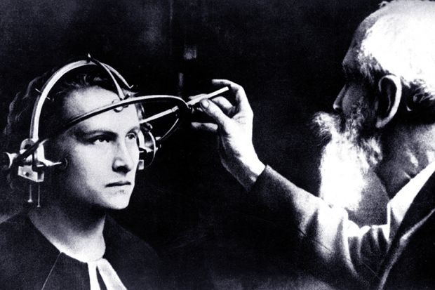

George Matthews, Plymouth State University

*2020*

---

.left-column[

#### 1*.* Behaviorism

#### .fade-out[2*.* Neuroscience]

#### .fade-out[3*.* Cognitive Science]

]

.right-column[

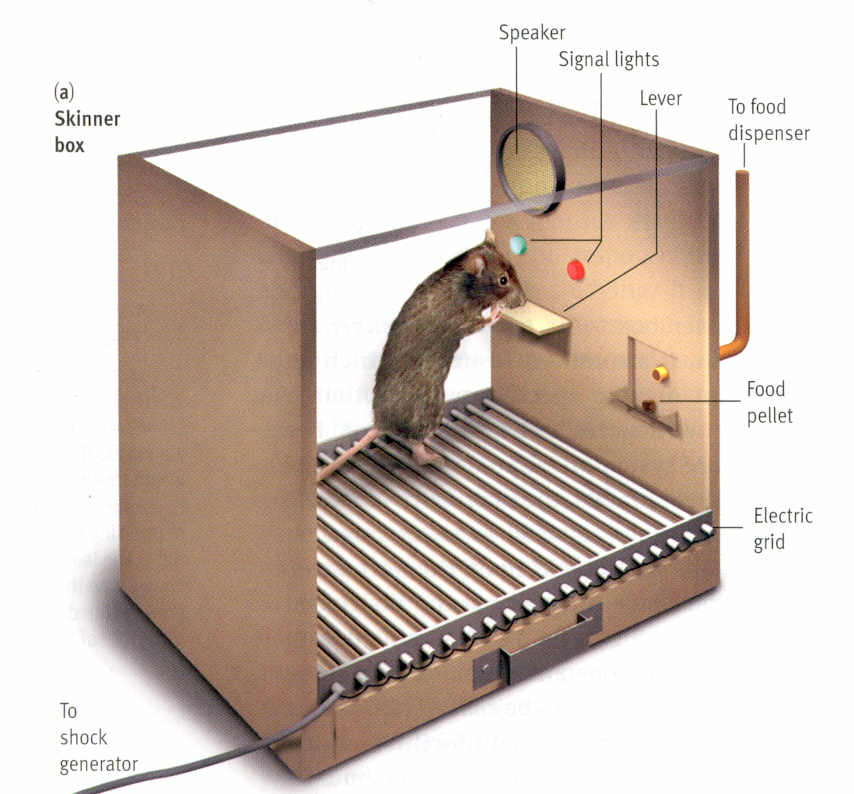

]

---

.left-column[

#### .fade-out[1*.* Behaviorism]

#### 2*.* Neuroscience

#### .fade-out[3*.* Cognitive Science]

]

.right-column[

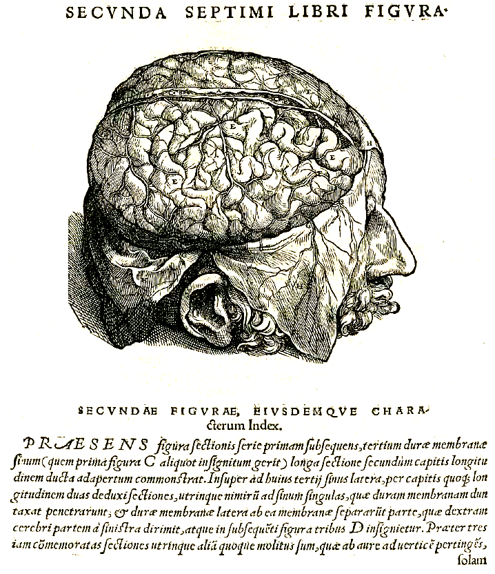

]

---

.left-column[

#### .fade-out[1*.* Behaviorism]

#### .fade-out[2*.* Neuroscience]

#### 3*.* Cognitive Science

]

.right-column[

]

---

### *prehistory*

.left-column[

]

.right-column[

.argument[

"I am really distinct from my body and can exist without it."

]
]

--

.right-list[

- Descartes gave a philosophical defense of the traditional conception that the mind, or soul, is essentially distinct from the body, otherwise known as  .red[dualism].

]

--

.right-list[

- If science is the study of the physical universe, and the mind is separate from this universe, how can the mind be studied scientifically?

]

---

### *prehistory*

.left-column[

]

.right-column[

.argument[

"What is the heart but a spring, and the nerves but so many strings, and the joints but so many wheels, giving motion to the whole body?"

]
]

--

.right-list[

- Hobbes suggested a mechanistic theory of mind, but this remained a metaphoric model.

]

--

.right-list[

- How can we study the mind scientifically when it seems to be different than physical phenomena which are accessible to public inspection and objective experimentation?

]

---
class: middle

---

### *1. Behaviorism*

.left-column[

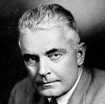

]

.right-column[

.argument[

"Psychology as the behaviorist views it is a purely objective experimental branch of natural science. Its theoretical goal is the prediction and control of behavior."

]
]

--

.right-list[

- Behaviorism ignores the "inner world" of conscious experience and focuses on what organisms with minds **_do_** in controlled experiments.

]

--

.right-list[

- Watson's vision of a scientific psychology was of a science with all of the predictive power of physics.

]

---
class: middle

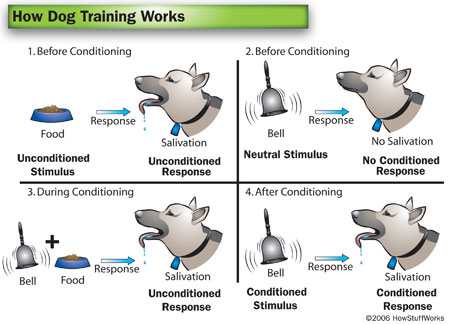

---
class: middle

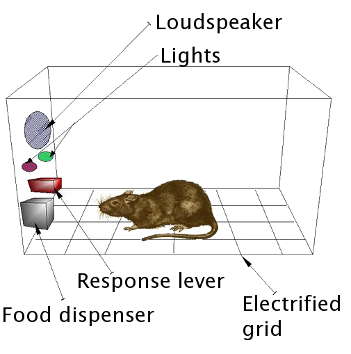

---
class: center

### *How predictable are people?*

--

.pull-left[

]

--

.pull-right[

]

--

---

### *2. Neuroscience*

.left-column[

]

.right-column[

.argument[

"From the brain, and from the brain only, arise our pleasures, joys, laughter and jests, as well as our sorrows, pains, griefs and tears. Through it, in particular, we think, see, hear, and distinguish the ugly from the beautiful, the bad from the good, the pleasant from the unpleasant"

]
]

--

.right-list[

- The role of the brain in mental life was suspected for thousands of years before a comprehensive theory was developed.

]

--

.right-list[

- What theoretical developments were crucial to the birth of neuroscience?

]

---

class: middle

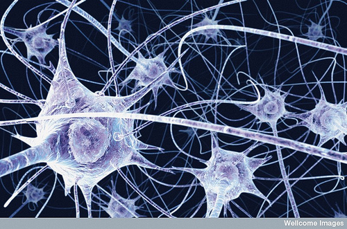

---

class: middle

---

class: middle

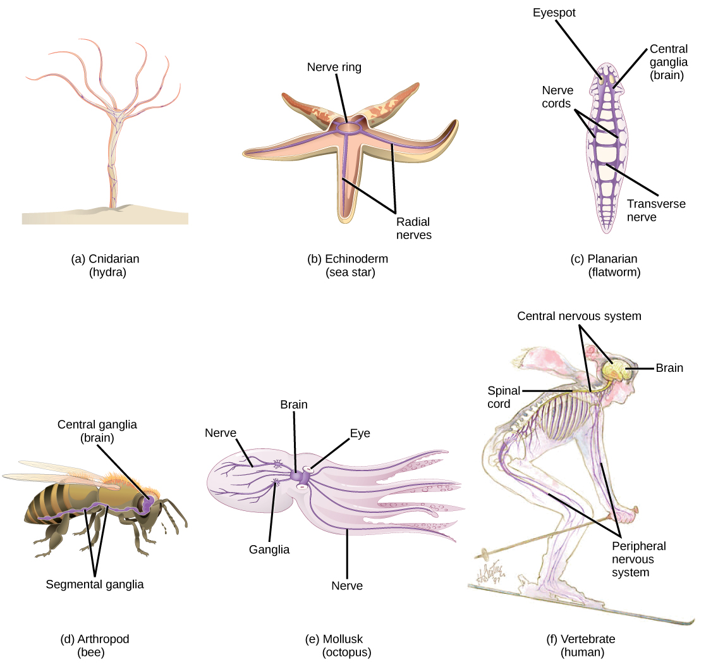

---
class: center

### *Is this all there is to me?*

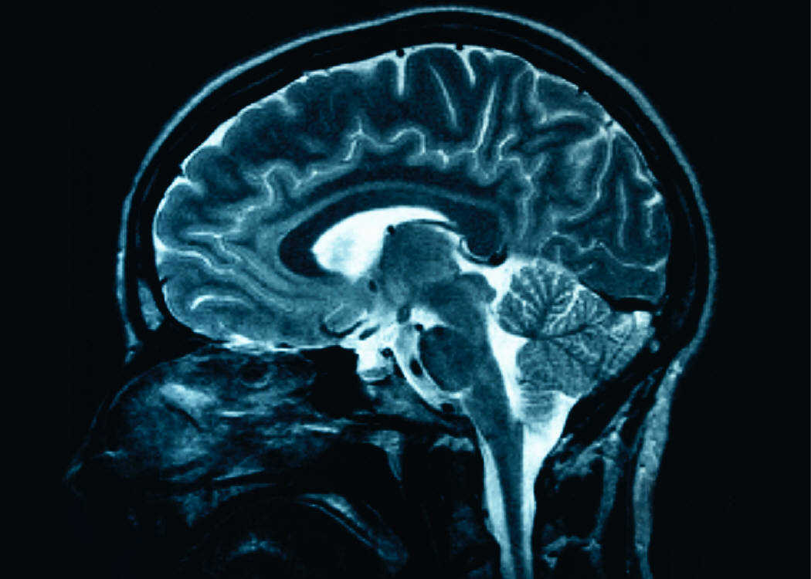

---

### *3. Cognitive Science*

.left-column[

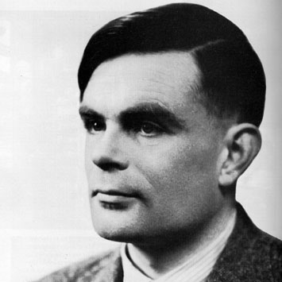

]

.right-column[

.argument[

"A computer would deserve to be called intelligent if it could deceive a human into believing that it was human."

]
]

--

.right-list[

- Turing laid the foundations for computer science as well the new sciences of the mind collectively called "cognitive science."

]

--

.right-list[

- Cognitive science looks at the ways in which minds process information enabling organisms who have them to adapt to changing circumstances in real time.

]

---

class: middle

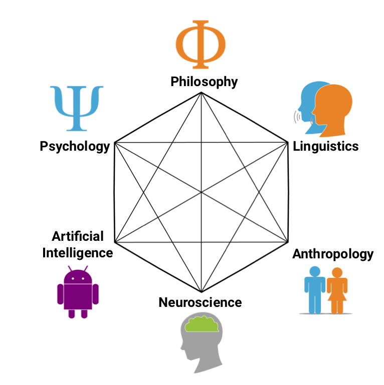

---

### *Are we nothing but fancy biological machines?*

---

class: center credits middle

.credit-image[
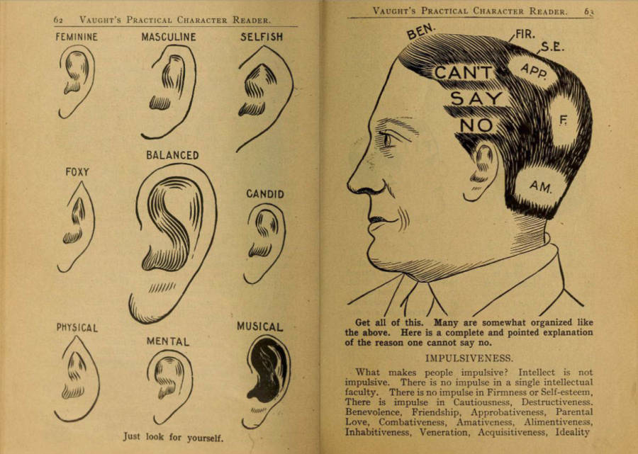
]

#### Credits

*Built with:* 

 html presentation framework 

[download this presentation](./pdf/11-slides.pdf) or [print it](./pdf/11-handout.pdf)

: requires a (free) GitHub account.

