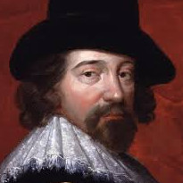

class: middle center

### *Science, Technology and Ethics*

*on knowledge and power*

George Matthews, Plymouth State University

*2020*

---

.left-column[

]

.right-column[

.topcap[

"Knowledge itself is power."

]

]

--

.right-list[

- Power to predict and control natural forces to ones own and humanity's advantage?

]

--

.right-list[
 
- Power over those who lack knowledge that we have access to?

]

--

.right-list[

- How can we use the power that knowledge offers wisely and ethically?

]

---

### *Example 1: Surveillance*

--

.question[

Should I be concerned with being tracked and recorded if I am not doing anything wrong?

]

---

### *Example 2: Facial Recognition Technology*

--

.question[

Do I have a right to obscurity in public places where I do not know anyone personally?

]

---

### *Example 3: Clickbait*

--

.question[

What are the social and political consequences of automated "content curation"?

]

---

### *Example 4: Military Drones (UAV's)*

--

.question[

Is it acceptable to deploy drones over countries with whom we are not officially at war and to use them to carry out lethal attacks?

]

---

class: center credits

.credit-image[

]

#### Credits

*Built with:* 

 html presentation framework 

[download this presentation](./pdf/11-slides.pdf) or [print it](./pdf/11-handout.pdf)

: requires a (free) GitHub account.

